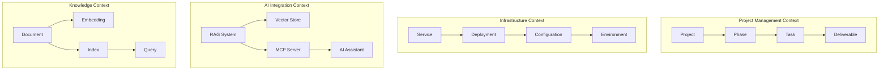
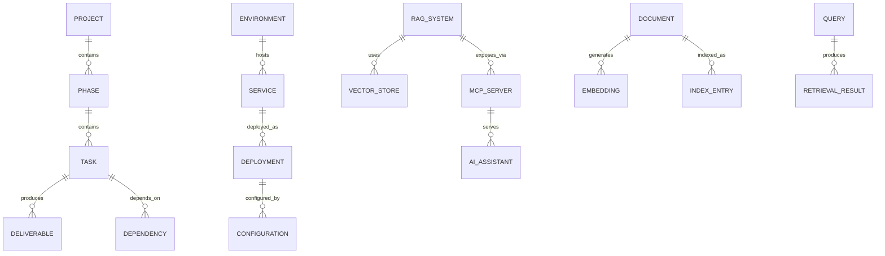
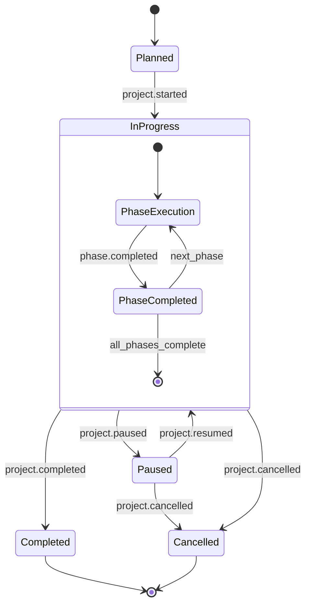
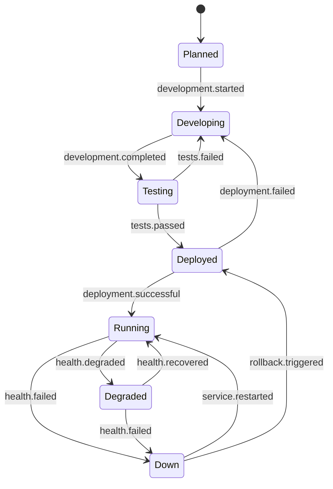
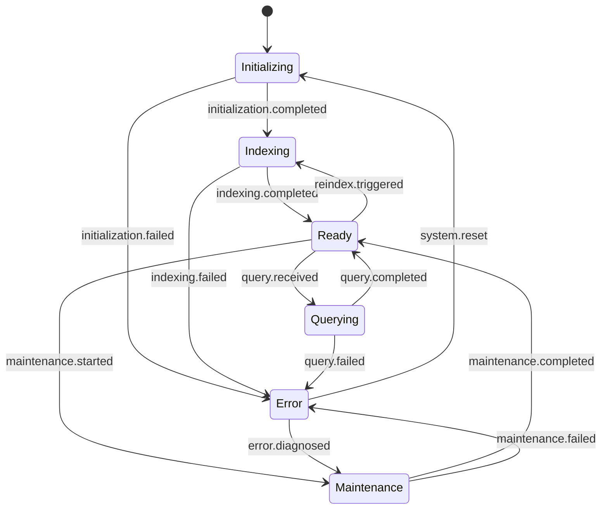

# RAG + MCP + TaskMaster Domain Model & Event Architecture

## Executive Summary

This document defines the domain model and event architecture for the RAG + MCP + TaskMaster implementation roadmap. It provides a structured approach to managing the complex integration of retrieval-augmented generation, model context protocol, and task management systems within the home lab environment.

**Purpose**: Enable systematic tracking, state management, and event-driven coordination across all implementation phases.

## Table of Contents

1. [Domain Model Overview](#domain-model-overview)
2. [Core Entities](#core-entities)
3. [Event Model](#event-model)
4. [State Machines](#state-machines)
5. [Integration Events](#integration-events)
6. [Implementation Schema](#implementation-schema)
7. [Event Sourcing Pattern](#event-sourcing-pattern)

## Domain Model Overview

### Bounded Contexts



### Core Domain Relationships



## Core Entities

### Project Management Domain

#### Project Aggregate
```typescript
interface Project {
  id: ProjectId;
  name: string;
  description: string;
  status: ProjectStatus;
  phases: Phase[];
  startDate: Date;
  targetCompletionDate: Date;
  actualCompletionDate?: Date;
  resources: ResourceRequirement[];
  risks: Risk[];
  metadata: ProjectMetadata;
}

enum ProjectStatus {
  PLANNED = "planned",
  IN_PROGRESS = "in_progress", 
  PAUSED = "paused",
  COMPLETED = "completed",
  CANCELLED = "cancelled"
}

interface ProjectMetadata {
  priority: Priority;
  complexity: Complexity;
  impact: Impact;
  dependencies: ExternalDependency[];
}
```

#### Phase Entity
```typescript
interface Phase {
  id: PhaseId;
  projectId: ProjectId;
  name: string;
  description: string;
  status: PhaseStatus;
  objective: string;
  tasks: Task[];
  deliverables: Deliverable[];
  duration: Duration;
  dependencies: PhaseDependency[];
  successCriteria: SuccessCriterion[];
}

enum PhaseStatus {
  PENDING = "pending",
  IN_PROGRESS = "in_progress",
  COMPLETED = "completed", 
  BLOCKED = "blocked",
  DEFERRED = "deferred"
}
```

#### Task Entity
```typescript
interface Task {
  id: TaskId;
  phaseId: PhaseId;
  name: string;
  description: string;
  status: TaskStatus;
  assignee?: UserId;
  estimatedEffort: Duration;
  actualEffort?: Duration;
  dependencies: TaskDependency[];
  deliverables: Deliverable[];
  implementation: Implementation;
  validation: ValidationCriteria;
}

enum TaskStatus {
  TODO = "todo",
  IN_PROGRESS = "in_progress",
  TESTING = "testing",
  REVIEW = "review",
  DONE = "done",
  BLOCKED = "blocked"
}
```

### Infrastructure Domain

#### Service Aggregate
```typescript
interface Service {
  id: ServiceId;
  name: string;
  type: ServiceType;
  status: ServiceStatus;
  deployments: Deployment[];
  configuration: ServiceConfiguration;
  dependencies: ServiceDependency[];
  healthChecks: HealthCheck[];
  metrics: ServiceMetrics;
}

enum ServiceType {
  RAG_CORE = "rag_core",
  MCP_SERVER = "mcp_server", 
  TASK_MASTER = "task_master",
  VECTOR_DB = "vector_db",
  LLM_GATEWAY = "llm_gateway"
}

enum ServiceStatus {
  PLANNED = "planned",
  DEVELOPING = "developing",
  TESTING = "testing",
  DEPLOYED = "deployed",
  RUNNING = "running",
  DEGRADED = "degraded",
  DOWN = "down"
}
```

#### Deployment Entity
```typescript
interface Deployment {
  id: DeploymentId;
  serviceId: ServiceId;
  version: Version;
  environment: Environment;
  status: DeploymentStatus;
  configuration: DeploymentConfiguration;
  timestamp: Date;
  rollbackConfiguration?: DeploymentConfiguration;
}

enum DeploymentStatus {
  PENDING = "pending",
  IN_PROGRESS = "in_progress",
  SUCCESSFUL = "successful",
  FAILED = "failed",
  ROLLED_BACK = "rolled_back"
}
```

### AI Integration Domain

#### RAG System Aggregate
```typescript
interface RAGSystem {
  id: RAGSystemId;
  name: string;
  status: RAGSystemStatus;
  vectorStore: VectorStore;
  embeddingModel: EmbeddingModel;
  retrievalConfiguration: RetrievalConfiguration;
  generationConfiguration: GenerationConfiguration;
  documents: DocumentIndex;
  queries: QueryHistory[];
  performance: PerformanceMetrics;
}

enum RAGSystemStatus {
  INITIALIZING = "initializing",
  INDEXING = "indexing",
  READY = "ready",
  QUERYING = "querying",
  MAINTENANCE = "maintenance",
  ERROR = "error"
}
```

#### MCP Server Entity
```typescript
interface MCPServer {
  id: MCPServerId;
  name: string;
  status: MCPServerStatus;
  protocol: MCPProtocol;
  tools: MCPTool[];
  resources: MCPResource[];
  clients: MCPClient[];
  capabilities: MCPCapability[];
  integration: IntegrationConfiguration;
}

enum MCPServerStatus {
  STOPPED = "stopped",
  STARTING = "starting", 
  RUNNING = "running",
  ERROR = "error",
  RESTARTING = "restarting"
}
```

### Knowledge Domain

#### Document Entity
```typescript
interface Document {
  id: DocumentId;
  path: string;
  content: string;
  metadata: DocumentMetadata;
  embeddings: Embedding[];
  indexStatus: IndexStatus;
  lastModified: Date;
  processingHistory: ProcessingEvent[];
}

interface DocumentMetadata {
  title: string;
  type: DocumentType;
  tags: Tag[];
  source: DocumentSource;
  format: DocumentFormat;
  size: number;
}

enum IndexStatus {
  PENDING = "pending",
  PROCESSING = "processing",
  INDEXED = "indexed",
  ERROR = "error",
  STALE = "stale"
}
```

## Event Model

### Project Management Events

#### Project Events
```typescript
// Project Lifecycle Events
interface ProjectCreated {
  type: "project.created";
  projectId: ProjectId;
  name: string;
  description: string;
  phases: PhaseDefinition[];
  timestamp: Date;
}

interface ProjectStarted {
  type: "project.started";
  projectId: ProjectId;
  startDate: Date;
  timestamp: Date;
}

interface ProjectCompleted {
  type: "project.completed";
  projectId: ProjectId;
  completionDate: Date;
  finalStatus: ProjectStatus;
  deliverables: Deliverable[];
  timestamp: Date;
}

interface ProjectStatusChanged {
  type: "project.status_changed";
  projectId: ProjectId;
  previousStatus: ProjectStatus;
  newStatus: ProjectStatus;
  reason: string;
  timestamp: Date;
}
```

#### Phase Events
```typescript
interface PhaseStarted {
  type: "phase.started";
  phaseId: PhaseId;
  projectId: ProjectId;
  plannedDuration: Duration;
  timestamp: Date;
}

interface PhaseCompleted {
  type: "phase.completed";
  phaseId: PhaseId;
  projectId: ProjectId;
  actualDuration: Duration;
  deliverables: Deliverable[];
  successCriteriaMet: boolean;
  timestamp: Date;
}

interface PhaseBlocked {
  type: "phase.blocked";
  phaseId: PhaseId;
  projectId: ProjectId;
  blockingIssue: BlockingIssue;
  estimatedDelay: Duration;
  timestamp: Date;
}
```

#### Task Events
```typescript
interface TaskCreated {
  type: "task.created";
  taskId: TaskId;
  phaseId: PhaseId;
  name: string;
  description: string;
  estimatedEffort: Duration;
  dependencies: TaskDependency[];
  timestamp: Date;
}

interface TaskStarted {
  type: "task.started";
  taskId: TaskId;
  assignee: UserId;
  startDate: Date;
  timestamp: Date;
}

interface TaskCompleted {
  type: "task.completed";
  taskId: TaskId;
  completionDate: Date;
  actualEffort: Duration;
  deliverables: Deliverable[];
  timestamp: Date;
}

interface TaskStatusChanged {
  type: "task.status_changed";
  taskId: TaskId;
  previousStatus: TaskStatus;
  newStatus: TaskStatus;
  reason: string;
  timestamp: Date;
}
```

### Infrastructure Events

#### Service Events
```typescript
interface ServiceDeploymentStarted {
  type: "service.deployment_started";
  serviceId: ServiceId;
  deploymentId: DeploymentId;
  version: Version;
  environment: Environment;
  timestamp: Date;
}

interface ServiceDeploymentCompleted {
  type: "service.deployment_completed";
  serviceId: ServiceId;
  deploymentId: DeploymentId;
  status: DeploymentStatus;
  healthCheckResults: HealthCheckResult[];
  timestamp: Date;
}

interface ServiceHealthChanged {
  type: "service.health_changed";
  serviceId: ServiceId;
  previousStatus: ServiceStatus;
  newStatus: ServiceStatus;
  healthMetrics: HealthMetrics;
  timestamp: Date;
}

interface ServiceConfigurationUpdated {
  type: "service.configuration_updated";
  serviceId: ServiceId;
  previousConfiguration: ServiceConfiguration;
  newConfiguration: ServiceConfiguration;
  changeReason: string;
  timestamp: Date;
}
```

### AI Integration Events

#### RAG System Events
```typescript
interface RAGSystemInitialized {
  type: "rag.system_initialized";
  ragSystemId: RAGSystemId;
  configuration: RAGConfiguration;
  vectorStoreId: VectorStoreId;
  embeddingModelId: EmbeddingModelId;
  timestamp: Date;
}

interface DocumentIndexingStarted {
  type: "rag.indexing_started";
  ragSystemId: RAGSystemId;
  batchId: BatchId;
  documentCount: number;
  estimatedDuration: Duration;
  timestamp: Date;
}

interface DocumentIndexingCompleted {
  type: "rag.indexing_completed";
  ragSystemId: RAGSystemId;
  batchId: BatchId;
  processedDocuments: number;
  successfulIndexes: number;
  errors: IndexingError[];
  actualDuration: Duration;
  timestamp: Date;
}

interface QueryExecuted {
  type: "rag.query_executed";
  ragSystemId: RAGSystemId;
  queryId: QueryId;
  query: string;
  retrievedDocuments: number;
  responseTime: Duration;
  relevanceScore: number;
  timestamp: Date;
}
```

#### MCP Integration Events
```typescript
interface MCPServerStarted {
  type: "mcp.server_started";
  mcpServerId: MCPServerId;
  protocol: MCPProtocol;
  availableTools: MCPTool[];
  availableResources: MCPResource[];
  timestamp: Date;
}

interface MCPClientConnected {
  type: "mcp.client_connected";
  mcpServerId: MCPServerId;
  clientId: MCPClientId;
  clientType: MCPClientType;
  capabilities: MCPCapability[];
  timestamp: Date;
}

interface MCPToolInvoked {
  type: "mcp.tool_invoked";
  mcpServerId: MCPServerId;
  clientId: MCPClientId;
  toolName: string;
  parameters: ToolParameters;
  executionTime: Duration;
  success: boolean;
  timestamp: Date;
}

interface MCPResourceAccessed {
  type: "mcp.resource_accessed";
  mcpServerId: MCPServerId;
  clientId: MCPClientId;
  resourceUri: string;
  accessType: AccessType;
  responseSize: number;
  timestamp: Date;
}
```

## State Machines

### Project State Machine



### Service State Machine



### RAG System State Machine



## Integration Events

### Cross-System Coordination Events

```typescript
// Project-Infrastructure Integration
interface InfrastructureRequirementIdentified {
  type: "integration.infrastructure_requirement";
  projectId: ProjectId;
  phaseId: PhaseId;
  requiredServices: ServiceRequirement[];
  targetEnvironment: Environment;
  deadline: Date;
  timestamp: Date;
}

interface ServiceProvisionedForProject {
  type: "integration.service_provisioned";
  projectId: ProjectId;
  serviceId: ServiceId;
  environment: Environment;
  endpoints: ServiceEndpoint[];
  timestamp: Date;
}

// RAG-MCP Integration
interface RAGSystemConnectedToMCP {
  type: "integration.rag_mcp_connected";
  ragSystemId: RAGSystemId;
  mcpServerId: MCPServerId;
  availableTools: string[];
  availableResources: string[];
  timestamp: Date;
}

interface KnowledgeUpdatedInRAG {
  type: "integration.knowledge_updated";
  ragSystemId: RAGSystemId;
  updatedDocuments: DocumentId[];
  affectedQueries: QueryId[];
  reindexRequired: boolean;
  timestamp: Date;
}

// Task Master Integration
interface TaskMasterProjectSynced {
  type: "integration.taskmaster_synced";
  projectId: ProjectId;
  taskMasterId: TaskMasterId;
  syncedTasks: TaskId[];
  syncedDeliverables: DeliverableId[];
  timestamp: Date;
}

interface AIRecommendationGenerated {
  type: "integration.ai_recommendation";
  sourceSystem: SystemId;
  targetEntity: EntityId;
  recommendationType: RecommendationType;
  recommendation: Recommendation;
  confidence: number;
  timestamp: Date;
}
```

## Implementation Schema

### Event Store Schema

```sql
-- Event Store Table
CREATE TABLE event_store (
    id SERIAL PRIMARY KEY,
    aggregate_id UUID NOT NULL,
    aggregate_type VARCHAR(50) NOT NULL,
    event_type VARCHAR(100) NOT NULL,
    event_data JSONB NOT NULL,
    event_metadata JSONB,
    version INTEGER NOT NULL,
    timestamp TIMESTAMP WITH TIME ZONE DEFAULT NOW(),
    correlation_id UUID,
    causation_id UUID,
    
    CONSTRAINT unique_aggregate_version UNIQUE (aggregate_id, version)
);

-- Projection Tables
CREATE TABLE project_projections (
    id UUID PRIMARY KEY,
    name VARCHAR(255) NOT NULL,
    status VARCHAR(20) NOT NULL,
    current_phase_id UUID,
    progress_percentage DECIMAL(5,2),
    start_date DATE,
    target_completion_date DATE,
    actual_completion_date DATE,
    last_updated TIMESTAMP WITH TIME ZONE DEFAULT NOW()
);

CREATE TABLE service_projections (
    id UUID PRIMARY KEY,
    name VARCHAR(100) NOT NULL,
    type VARCHAR(50) NOT NULL,
    status VARCHAR(20) NOT NULL,
    environment VARCHAR(20) NOT NULL,
    current_version VARCHAR(20),
    health_status VARCHAR(20),
    last_deployment TIMESTAMP WITH TIME ZONE,
    last_updated TIMESTAMP WITH TIME ZONE DEFAULT NOW()
);

CREATE TABLE rag_system_projections (
    id UUID PRIMARY KEY,
    name VARCHAR(100) NOT NULL,
    status VARCHAR(20) NOT NULL,
    indexed_documents INTEGER DEFAULT 0,
    last_indexing TIMESTAMP WITH TIME ZONE,
    query_count INTEGER DEFAULT 0,
    average_response_time_ms INTEGER,
    last_updated TIMESTAMP WITH TIME ZONE DEFAULT NOW()
);
```

### Event Handler Framework

```typescript
// Event Handler Interface
interface EventHandler<T extends DomainEvent> {
  handle(event: T): Promise<void>;
  getEventType(): string;
}

// Example Event Handlers
class ProjectStatusChangedHandler implements EventHandler<ProjectStatusChanged> {
  async handle(event: ProjectStatusChanged): Promise<void> {
    // Update read model projections
    await this.updateProjectProjection(event);
    
    // Trigger downstream events if needed
    if (event.newStatus === ProjectStatus.COMPLETED) {
      await this.publishProjectCompletedIntegrationEvent(event);
    }
    
    // Send notifications
    await this.notifyStakeholders(event);
  }
  
  getEventType(): string {
    return "project.status_changed";
  }
}

class RAGIndexingCompletedHandler implements EventHandler<DocumentIndexingCompleted> {
  async handle(event: DocumentIndexingCompleted): Promise<void> {
    // Update RAG system projection
    await this.updateRAGProjection(event);
    
    // Notify MCP server of updated knowledge
    await this.notifyMCPServer(event);
    
    // Update project progress if this was part of a project task
    await this.updateRelatedProjectProgress(event);
  }
  
  getEventType(): string {
    return "rag.indexing_completed";
  }
}
```

## Event Sourcing Pattern

### Command Handlers

```typescript
// Command Interface
interface Command {
  aggregateId: string;
  expectedVersion: number;
}

// Example Commands
interface StartProject extends Command {
  type: "start_project";
  name: string;
  description: string;
  phases: PhaseDefinition[];
}

interface DeployService extends Command {
  type: "deploy_service";
  serviceId: ServiceId;
  version: Version;
  environment: Environment;
  configuration: DeploymentConfiguration;
}

interface IndexDocuments extends Command {
  type: "index_documents";
  ragSystemId: RAGSystemId;
  documents: Document[];
  batchSize: number;
}

// Command Handlers
class ProjectCommandHandler {
  async handle(command: StartProject): Promise<ProjectCreated[]> {
    // Load existing events for aggregate
    const existingEvents = await this.eventStore.getEvents(command.aggregateId);
    
    // Reconstruct aggregate state
    const project = Project.fromEvents(existingEvents);
    
    // Execute business logic
    const newEvents = project.start(command);
    
    // Save events
    await this.eventStore.saveEvents(
      command.aggregateId,
      newEvents,
      command.expectedVersion
    );
    
    return newEvents;
  }
}
```

### Aggregate Root Pattern

```typescript
class Project {
  private events: DomainEvent[] = [];
  
  constructor(
    public readonly id: ProjectId,
    public status: ProjectStatus = ProjectStatus.PLANNED,
    public phases: Phase[] = []
  ) {}
  
  static fromEvents(events: DomainEvent[]): Project {
    const project = new Project(events[0].aggregateId);
    
    events.forEach(event => {
      project.apply(event);
    });
    
    return project;
  }
  
  start(command: StartProject): DomainEvent[] {
    if (this.status !== ProjectStatus.PLANNED) {
      throw new Error("Project must be in planned status to start");
    }
    
    const event = new ProjectStarted({
      projectId: this.id,
      startDate: new Date(),
      timestamp: new Date()
    });
    
    this.applyAndTrack(event);
    return this.getUncommittedEvents();
  }
  
  private apply(event: DomainEvent): void {
    switch (event.type) {
      case "project.created":
        this.applyProjectCreated(event as ProjectCreated);
        break;
      case "project.started":
        this.applyProjectStarted(event as ProjectStarted);
        break;
      // ... other event handlers
    }
  }
  
  private applyProjectStarted(event: ProjectStarted): void {
    this.status = ProjectStatus.IN_PROGRESS;
  }
  
  private applyAndTrack(event: DomainEvent): void {
    this.apply(event);
    this.events.push(event);
  }
  
  getUncommittedEvents(): DomainEvent[] {
    return [...this.events];
  }
  
  markEventsAsCommitted(): void {
    this.events = [];
  }
}
```

## Usage Examples

### Tracking Project Progress

```typescript
// Query current project status
const projectStatus = await projectRepository.getProjectStatus(projectId);

// Get detailed phase breakdown
const phaseProgress = await phaseRepository.getPhaseProgress(projectId);

// Generate project dashboard data
const dashboardData = {
  overall: projectStatus,
  phases: phaseProgress,
  recentEvents: await eventStore.getRecentEvents(projectId, 10),
  upcomingMilestones: await milestoneRepository.getUpcoming(projectId)
};
```

### Monitoring System Health

```typescript
// Real-time service monitoring
const serviceHealth = await serviceRepository.getServiceHealth();

// Check deployment status
const deploymentStatus = await deploymentRepository.getCurrentDeployments();

// RAG system performance metrics
const ragMetrics = await ragRepository.getPerformanceMetrics();

// Generate operations dashboard
const opsData = {
  services: serviceHealth,
  deployments: deploymentStatus,
  rag: ragMetrics,
  alerts: await alertRepository.getActiveAlerts()
};
```

### Event-Driven Automation

```typescript
// Automatic service provisioning when project phase starts
class PhaseStartedHandler implements EventHandler<PhaseStarted> {
  async handle(event: PhaseStarted): Promise<void> {
    const phase = await phaseRepository.getById(event.phaseId);
    
    // Check if this phase requires new infrastructure
    const infraRequirements = phase.getInfrastructureRequirements();
    
    for (const requirement of infraRequirements) {
      // Trigger service provisioning
      await this.commandBus.send(new ProvisionService({
        serviceType: requirement.serviceType,
        environment: requirement.environment,
        configuration: requirement.configuration,
        projectId: event.projectId,
        phaseId: event.phaseId
      }));
    }
  }
}
```

This domain model and event architecture provides a robust foundation for managing the complex RAG + MCP + TaskMaster implementation, enabling clear tracking of progress, automated coordination between systems, and comprehensive monitoring of the entire ecosystem.
