# Vue/Nuxt Web Interface Design for RAG + MCP + TaskMaster

## Executive Summary

This document outlines the design for a modern Vue/Nuxt web interface that integrates with the existing RAG + MCP + TaskMaster domain model and event architecture. The web interface provides a centralized dashboard for managing projects, monitoring infrastructure, interacting with AI systems, and exploring knowledge bases.

**Key Features:**

- Real-time project and task management
- Infrastructure monitoring and control
- RAG system interaction and query interface
- MCP server management
- Event-driven updates and notifications
- Responsive, modern UI with TypeScript support

## Table of Contents

1. [Architecture Overview](#architecture-overview)
2. [Component Architecture](#component-architecture)
3. [API Integration Strategy](#api-integration-strategy)
4. [Real-time Data Flow](#real-time-data-flow)
5. [Page Structure](#page-structure)
6. [State Management](#state-management)
7. [Authentication & Security](#authentication--security)
8. [Implementation Plan](#implementation-plan)

## Architecture Overview

### Technology Stack

```mermaid
graph TB
    subgraph "Frontend Layer"
        A[Nuxt 3] --> B[Vue 3 Composition API]
        B --> C[TypeScript]
        C --> D[Tailwind CSS / Nuxt UI]
        D --> E[VueUse Composables]
    end
    
    subgraph "API Layer"
        F[Nuxt Server API] --> G[h3 Event Handlers]
        G --> H[Runtime Config]
        H --> I[Request Validation]
    end
    
    subgraph "Integration Layer"
        J[Python RAG Service] --> K[FastAPI/Guile Bridge]
        K --> L[MCP Server]
        L --> M[TaskMaster CLI/API]
    end
    
    subgraph "Real-time Layer"
        N[WebSocket/SSE] --> O[Event Bus]
        O --> P[Reactive State]
        P --> Q[Component Updates]
    end
```



### Directory Structure

```
nuxt-web-interface/
├── components/
│   ├── dashboard/
│   │   ├── ProjectOverview.vue
│   │   ├── TaskBoard.vue
│   │   ├── InfrastructureStatus.vue
│   │   └── ActivityFeed.vue
│   ├── project/
│   │   ├── ProjectCard.vue
│   │   ├── PhaseTimeline.vue
│   │   ├── TaskList.vue
│   │   └── DeliverableTracker.vue
│   ├── infrastructure/
│   │   ├── ServiceGrid.vue
│   │   ├── DeploymentStatus.vue
│   │   ├── LogViewer.vue
│   │   └── MetricsChart.vue
│   ├── rag/
│   │   ├── QueryInterface.vue
│   │   ├── DocumentExplorer.vue
│   │   ├── EmbeddingVisualizer.vue
│   │   └── ResultsPanel.vue
│   ├── mcp/
│   │   ├── ServerStatus.vue
│   │   ├── ToolRegistry.vue
│   │   ├── ClientConnections.vue
│   │   └── CapabilityMatrix.vue
│   └── ui/
│       ├── LoadingSpinner.vue
│       ├── NotificationToast.vue
│       ├── ConfirmDialog.vue
│       └── StatusBadge.vue
├── composables/
│   ├── useProject.ts
│   ├── useInfrastructure.ts
│   ├── useRAG.ts
│   ├── useMCP.ts
│   ├── useWebSocket.ts
│   ├── useEventBus.ts
│   └── useNotifications.ts
├── pages/
│   ├── index.vue
│   ├── projects/
│   │   ├── index.vue
│   │   ├── [id].vue
│   │   └── new.vue
│   ├── infrastructure/
│   │   ├── index.vue
│   │   ├── services.vue
│   │   └── deployments.vue
│   ├── rag/
│   │   ├── index.vue
│   │   ├── query.vue
│   │   └── documents.vue
│   ├── mcp/
│   │   ├── index.vue
│   │   ├── servers.vue
│   │   └── tools.vue
│   └── settings/
│       ├── index.vue
│       └── integrations.vue
├── server/
│   └── api/
│       ├── projects/
│       │   ├── index.get.ts
│       │   ├── index.post.ts
│       │   ├── [id].get.ts
│       │   └── [id].patch.ts
│       ├── infrastructure/
│       │   ├── services.get.ts
│       │   └── deployments.get.ts
│       ├── rag/
│       │   ├── query.post.ts
│       │   ├── documents.get.ts
│       │   └── embeddings.get.ts
│       ├── mcp/
│       │   ├── servers.get.ts
│       │   └── tools.get.ts
│       └── events/
│           └── stream.get.ts
├── types/
│   ├── domain.ts
│   ├── api.ts
│   └── events.ts
└── nuxt.config.ts
```

## Component Architecture

### Core Composition API Patterns

#### Project Management Components

```vue
<!-- components/project/ProjectCard.vue -->
<script setup lang="ts">
import type { Project } from '~/types/domain'

interface Props {
  project: Project
}

const props = defineProps<Props>()
const emit = defineEmits<{
  'update:status': [status: ProjectStatus]
  'view:details': [projectId: string]
}>()

// Reactive state
const isExpanded = ref(false)
const { updateProjectStatus } = useProject()

// Computed properties
const statusColor = computed(() => {
  switch (props.project.status) {
    case 'completed': return 'green'
    case 'in_progress': return 'blue'
    case 'paused': return 'yellow'
    case 'cancelled': return 'red'
    default: return 'gray'
  }
})

const completionPercentage = computed(() => {
  if (!props.project.phases.length) return 0
  const completedPhases = props.project.phases.filter(p => p.status === 'completed').length
  return Math.round((completedPhases / props.project.phases.length) * 100)
})

// Event handlers
const handleStatusUpdate = async (newStatus: ProjectStatus) => {
  try {
    await updateProjectStatus(props.project.id, newStatus)
    emit('update:status', newStatus)
  } catch (error) {
    // Handle error with notification
    console.error('Failed to update project status:', error)
  }
}

const viewDetails = () => {
  emit('view:details', props.project.id)
}
</script>

<template>
  <div class="bg-white rounded-lg shadow-md p-6 hover:shadow-lg transition-shadow">
    <div class="flex justify-between items-start mb-4">
      <div>
        <h3 class="text-lg font-semibold text-gray-900">{{ project.name }}</h3>
        <p class="text-sm text-gray-600 mt-1">{{ project.description }}</p>
      </div>
      <StatusBadge :status="project.status" :color="statusColor" />
    </div>
    
    <div class="mb-4">
      <div class="flex justify-between text-sm text-gray-600 mb-1">
        <span>Progress</span>
        <span>{{ completionPercentage }}%</span>
      </div>
      <div class="w-full bg-gray-200 rounded-full h-2">
        <div 
          class="bg-blue-600 h-2 rounded-full transition-all duration-300"
          :style="{ width: `${completionPercentage}%` }"
        />
      </div>
    </div>
    
    <div class="flex justify-between items-center">
      <div class="text-sm text-gray-500">
        {{ project.phases.length }} phases
      </div>
      <div class="space-x-2">
        <button 
          @click="isExpanded = !isExpanded"
          class="text-blue-600 hover:text-blue-800 text-sm"
        >
          {{ isExpanded ? 'Collapse' : 'Expand' }}
        </button>
        <button 
          @click="viewDetails"
          class="bg-blue-600 text-white px-3 py-1 rounded text-sm hover:bg-blue-700"
        >
          View Details
        </button>
      </div>
    </div>
    
    <div v-if="isExpanded" class="mt-4 pt-4 border-t border-gray-200">
      <PhaseTimeline :phases="project.phases" @update:phase="handlePhaseUpdate" />
    </div>
  </div>
</template>
```

#### RAG Query Interface Component

```vue
<!-- components/rag/QueryInterface.vue -->
<script setup lang="ts">
import type { RAGQuery, RAGResult } from '~/types/domain'

// Reactive state
const query = ref('')
const isQuerying = ref(false)
const results = ref<RAGResult[]>([])
const queryHistory = ref<RAGQuery[]>([])

// Composables
const { executeQuery, getQueryHistory } = useRAG()
const { addNotification } = useNotifications()

// Load query history on mount
onMounted(async () => {
  try {
    queryHistory.value = await getQueryHistory()
  } catch (error) {
    console.error('Failed to load query history:', error)
  }
})

// Execute RAG query
const submitQuery = async () => {
  if (!query.value.trim()) return
  
  isQuerying.value = true
  try {
    const result = await executeQuery(query.value)
    results.value = result.documents
    
    // Add to history
    queryHistory.value.unshift({
      id: Date.now().toString(),
      query: query.value,
      timestamp: new Date(),
      resultCount: result.documents.length
    })
    
    addNotification({
      type: 'success',
      title: 'Query completed',
      message: `Found ${result.documents.length} relevant documents`
    })
  } catch (error) {
    console.error('Query failed:', error)
    addNotification({
      type: 'error',
      title: 'Query failed',
      message: 'Please try again or check the RAG system status'
    })
  } finally {
    isQuerying.value = false
  }
}

// Handle query from history
const selectHistoryQuery = (historicQuery: RAGQuery) => {
  query.value = historicQuery.query
}

// Clear results
const clearResults = () => {
  results.value = []
  query.value = ''
}
</script>

<template>
  <div class="space-y-6">
    <!-- Query Input -->
    <div class="bg-white rounded-lg shadow p-6">
      <h2 class="text-xl font-semibold mb-4">RAG Query Interface</h2>
      
      <div class="space-y-4">
        <div>
          <label for="query" class="block text-sm font-medium text-gray-700 mb-2">
            Enter your query
          </label>
          <textarea
            id="query"
            v-model="query"
            rows="3"
            class="w-full rounded-md border-gray-300 shadow-sm focus:border-blue-500 focus:ring-blue-500"
            placeholder="Ask a question about your documents..."
            @keydown.ctrl.enter="submitQuery"
          />
        </div>
        
        <div class="flex justify-between items-center">
          <div class="text-sm text-gray-500">
            Press Ctrl+Enter to submit
          </div>
          <div class="space-x-2">
            <button
              @click="clearResults"
              class="px-4 py-2 text-gray-600 border border-gray-300 rounded hover:bg-gray-50"
              :disabled="!results.length && !query"
            >
              Clear
            </button>
            <button
              @click="submitQuery"
              :disabled="!query.trim() || isQuerying"
              class="px-4 py-2 bg-blue-600 text-white rounded hover:bg-blue-700 disabled:opacity-50"
            >
              <LoadingSpinner v-if="isQuerying" class="inline w-4 h-4 mr-2" />
              {{ isQuerying ? 'Querying...' : 'Submit Query' }}
            </button>
          </div>
        </div>
      </div>
    </div>
    
    <!-- Query History -->
    <div v-if="queryHistory.length" class="bg-white rounded-lg shadow p-6">
      <h3 class="text-lg font-medium mb-4">Recent Queries</h3>
      <div class="space-y-2 max-h-40 overflow-y-auto">
        <div 
          v-for="historicQuery in queryHistory.slice(0, 5)"
          :key="historicQuery.id"
          class="p-2 bg-gray-50 rounded cursor-pointer hover:bg-gray-100"
          @click="selectHistoryQuery(historicQuery)"
        >
          <div class="text-sm font-medium truncate">{{ historicQuery.query }}</div>
          <div class="text-xs text-gray-500">
            {{ new Date(historicQuery.timestamp).toLocaleString() }} • 
            {{ historicQuery.resultCount }} results
          </div>
        </div>
      </div>
    </div>
    
    <!-- Results Panel -->
    <ResultsPanel v-if="results.length" :results="results" />
  </div>
</template>
```

### Composables Architecture

#### Project Management Composable

```typescript
// composables/useProject.ts
import type { Project, ProjectStatus, Phase, Task } from '~/types/domain'

export const useProject = () => {
  const projects = ref<Project[]>([])
  const currentProject = ref<Project | null>(null)
  const loading = ref(false)
  const error = ref<string | null>(null)

  // Fetch all projects
  const fetchProjects = async (): Promise<void> => {
    loading.value = true
    error.value = null
    
    try {
      const { data } = await $fetch<{ projects: Project[] }>('/api/projects')
      projects.value = data.projects
    } catch (err) {
      error.value = 'Failed to fetch projects'
      console.error('Error fetching projects:', err)
    } finally {
      loading.value = false
    }
  }

  // Fetch single project
  const fetchProject = async (id: string): Promise<Project | null> => {
    loading.value = true
    error.value = null
    
    try {
      const { data } = await $fetch<{ project: Project }>(`/api/projects/${id}`)
      currentProject.value = data.project
      return data.project
    } catch (err) {
      error.value = 'Failed to fetch project'
      console.error('Error fetching project:', err)
      return null
    } finally {
      loading.value = false
    }
  }

  // Create new project
  const createProject = async (projectData: Omit<Project, 'id'>): Promise<Project | null> => {
    loading.value = true
    error.value = null
    
    try {
      const { data } = await $fetch<{ project: Project }>('/api/projects', {
        method: 'POST',
        body: projectData
      })
      
      projects.value.push(data.project)
      return data.project
    } catch (err) {
      error.value = 'Failed to create project'
      console.error('Error creating project:', err)
      return null
    } finally {
      loading.value = false
    }
  }

  // Update project status
  const updateProjectStatus = async (id: string, status: ProjectStatus): Promise<boolean> => {
    try {
      await $fetch(`/api/projects/${id}`, {
        method: 'PATCH',
        body: { status }
      })
      
      // Update local state
      const projectIndex = projects.value.findIndex(p => p.id === id)
      if (projectIndex !== -1) {
        projects.value[projectIndex].status = status
      }
      
      if (currentProject.value?.id === id) {
        currentProject.value.status = status
      }
      
      return true
    } catch (err) {
      error.value = 'Failed to update project status'
      console.error('Error updating project status:', err)
      return false
    }
  }

  // Add new task to project
  const addTask = async (projectId: string, phaseId: string, taskData: Omit<Task, 'id'>): Promise<Task | null> => {
    try {
      const { data } = await $fetch<{ task: Task }>(`/api/projects/${projectId}/phases/${phaseId}/tasks`, {
        method: 'POST',
        body: taskData
      })
      
      // Update local state
      const project = projects.value.find(p => p.id === projectId)
      if (project) {
        const phase = project.phases.find(ph => ph.id === phaseId)
        if (phase) {
          phase.tasks.push(data.task)
        }
      }
      
      return data.task
    } catch (err) {
      error.value = 'Failed to add task'
      console.error('Error adding task:', err)
      return null
    }
  }

  // Computed properties
  const activeProjects = computed(() => 
    projects.value.filter(p => p.status === 'in_progress')
  )

  const completedProjects = computed(() => 
    projects.value.filter(p => p.status === 'completed')
  )

  const projectStats = computed(() => ({
    total: projects.value.length,
    active: activeProjects.value.length,
    completed: completedProjects.value.length,
    planned: projects.value.filter(p => p.status === 'planned').length
  }))

  return {
    // State
    projects: readonly(projects),
    currentProject: readonly(currentProject),
    loading: readonly(loading),
    error: readonly(error),
    
    // Actions
    fetchProjects,
    fetchProject,
    createProject,
    updateProjectStatus,
    addTask,
    
    // Computed
    activeProjects,
    completedProjects,
    projectStats
  }
}
```

#### Real-time Events Composable

```typescript
// composables/useEventBus.ts
import type { DomainEvent } from '~/types/events'

export const useEventBus = () => {
  const eventSource = ref<EventSource | null>(null)
  const connected = ref(false)
  const events = ref<DomainEvent[]>([])
  const lastEventId = ref<string | null>(null)

  // Event listeners
  const listeners = new Map<string, Set<(event: DomainEvent) => void>>()

  // Connect to server-sent events
  const connect = (): void => {
    if (eventSource.value) return

    eventSource.value = new EventSource('/api/events/stream')
    
    eventSource.value.onopen = () => {
      connected.value = true
      console.log('Event stream connected')
    }

    eventSource.value.onmessage = (event) => {
      try {
        const domainEvent: DomainEvent = JSON.parse(event.data)
        events.value.unshift(domainEvent)
        lastEventId.value = domainEvent.id
        
        // Emit to specific listeners
        const typeListeners = listeners.get(domainEvent.type)
        if (typeListeners) {
          typeListeners.forEach(listener => listener(domainEvent))
        }
        
        // Emit to wildcard listeners
        const wildcardListeners = listeners.get('*')
        if (wildcardListeners) {
          wildcardListeners.forEach(listener => listener(domainEvent))
        }
      } catch (error) {
        console.error('Failed to parse event:', error)
      }
    }

    eventSource.value.onerror = () => {
      connected.value = false
      console.error('Event stream error')
    }
  }

  // Disconnect from events
  const disconnect = (): void => {
    if (eventSource.value) {
      eventSource.value.close()
      eventSource.value = null
    }
    connected.value = false
  }

  // Subscribe to specific event types
  const subscribe = (eventType: string, callback: (event: DomainEvent) => void): () => void => {
    if (!listeners.has(eventType)) {
      listeners.set(eventType, new Set())
    }
    listeners.get(eventType)!.add(callback)
    
    // Return unsubscribe function
    return () => {
      const typeListeners = listeners.get(eventType)
      if (typeListeners) {
        typeListeners.delete(callback)
        if (typeListeners.size === 0) {
          listeners.delete(eventType)
        }
      }
    }
  }

  // Get events by type
  const getEventsByType = (eventType: string): DomainEvent[] => {
    return events.value.filter(event => event.type === eventType)
  }

  // Auto-connect on mount, disconnect on unmount
  onMounted(() => {
    connect()
  })

  onUnmounted(() => {
    disconnect()
  })

  return {
    // State
    connected: readonly(connected),
    events: readonly(events),
    lastEventId: readonly(lastEventId),
    
    // Actions
    connect,
    disconnect,
    subscribe,
    getEventsByType
  }
}
```

## API Integration Strategy

### Server API Routes

#### Project Management API

```typescript
// server/api/projects/index.get.ts
import type { Project } from '~/types/domain'

export default defineEventHandler(async (event): Promise<{ projects: Project[] }> => {
  try {
    // Get TaskMaster configuration
    const config = useRuntimeConfig(event)
    
    // Call TaskMaster via CLI or direct API
    const response = await $fetch(`${config.taskMasterUrl}/api/projects`, {
      headers: {
        'Authorization': `Bearer ${config.taskMasterApiKey}`
      }
    })
    
    return { projects: response.data }
  } catch (error) {
    console.error('Failed to fetch projects:', error)
    throw createError({
      statusCode: 500,
      statusMessage: 'Failed to fetch projects from TaskMaster'
    })
  }
})
```

```typescript
// server/api/projects/[id].patch.ts
export default defineEventHandler(async (event) => {
  const projectId = getRouterParam(event, 'id')
  const body = await readBody(event)
  
  if (!projectId) {
    throw createError({
      statusCode: 400,
      statusMessage: 'Project ID is required'
    })
  }
  
  try {
    const config = useRuntimeConfig(event)
    
    // Update project via TaskMaster API
    const response = await $fetch(`${config.taskMasterUrl}/api/projects/${projectId}`, {
      method: 'PATCH',
      headers: {
        'Authorization': `Bearer ${config.taskMasterApiKey}`,
        'Content-Type': 'application/json'
      },
      body
    })
    
    return { project: response.data }
  } catch (error) {
    console.error('Failed to update project:', error)
    throw createError({
      statusCode: 500,
      statusMessage: 'Failed to update project'
    })
  }
})
```

#### RAG System API

```typescript
// server/api/rag/query.post.ts
export default defineEventHandler(async (event) => {
  const { query, options = {} } = await readBody(event)
  
  if (!query || typeof query !== 'string') {
    throw createError({
      statusCode: 400,
      statusMessage: 'Query is required and must be a string'
    })
  }
  
  try {
    const config = useRuntimeConfig(event)
    
    // Call Python RAG service
    const response = await $fetch(`${config.ragServiceUrl}/query`, {
      method: 'POST',
      headers: {
        'Authorization': `Bearer ${config.ragServiceApiKey}`,
        'Content-Type': 'application/json'
      },
      body: {
        query,
        ...options
      }
    })
    
    return response
  } catch (error) {
    console.error('RAG query failed:', error)
    throw createError({
      statusCode: 500,
      statusMessage: 'RAG query failed'
    })
  }
})
```

#### Event Stream API

```typescript
// server/api/events/stream.get.ts
export default defineEventHandler(async (event) => {
  const config = useRuntimeConfig(event)
  
  // Set up Server-Sent Events
  setHeader(event, 'Content-Type', 'text/event-stream')
  setHeader(event, 'Cache-Control', 'no-cache')
  setHeader(event, 'Connection', 'keep-alive')
  setHeader(event, 'Access-Control-Allow-Origin', '*')
  
  // Connect to event source (Redis, EventStore, or direct connection)
  try {
    // This would connect to your event store
    const eventStream = await connectToEventStore(config.eventStoreUrl)
    
    eventStream.on('event', (domainEvent) => {
      event.node.res.write(`data: ${JSON.stringify(domainEvent)}\n\n`)
    })
    
    // Keep connection alive
    const keepAlive = setInterval(() => {
      event.node.res.write(': keep-alive\n\n')
    }, 30000)
    
    // Clean up on close
    event.node.req.on('close', () => {
      clearInterval(keepAlive)
      eventStream.close()
    })
    
  } catch (error) {
    console.error('Failed to connect to event stream:', error)
    throw createError({
      statusCode: 500,
      statusMessage: 'Failed to establish event stream'
    })
  }
})
```

## Page Structure

### Main Dashboard

```vue
<!-- pages/index.vue -->
<script setup lang="ts">
// SEO
useHead({
  title: 'RAG + MCP + TaskMaster Dashboard',
  meta: [
    { name: 'description', content: 'Home lab management dashboard for RAG, MCP, and TaskMaster integration' }
  ]
})

// Composables
const { projects, fetchProjects, projectStats } = useProject()
const { services, fetchServices } = useInfrastructure()
const { systemStatus } = useRAG()
const { servers } = useMCP()
const { subscribe } = useEventBus()

// Reactive state
const dashboardData = ref({
  recentActivity: [],
  alerts: [],
  systemHealth: 'healthy'
})

// Fetch initial data
onMounted(async () => {
  await Promise.all([
    fetchProjects(),
    fetchServices()
  ])
})

// Subscribe to real-time events
const unsubscribe = subscribe('*', (event) => {
  // Add to recent activity
  dashboardData.value.recentActivity.unshift({
    id: event.id,
    type: event.type,
    message: event.summary,
    timestamp: event.timestamp
  })
  
  // Keep only last 20 activities
  if (dashboardData.value.recentActivity.length > 20) {
    dashboardData.value.recentActivity = dashboardData.value.recentActivity.slice(0, 20)
  }
})

onUnmounted(() => {
  unsubscribe()
})
</script>

<template>
  <div class="space-y-6">
    <!-- Header -->
    <div class="bg-white shadow">
      <div class="px-6 py-4">
        <h1 class="text-2xl font-bold text-gray-900">
          RAG + MCP + TaskMaster Dashboard
        </h1>
        <p class="text-gray-600 mt-1">
          Monitor and manage your home lab infrastructure and AI systems
        </p>
      </div>
    </div>
    
    <!-- Stats Grid -->
    <div class="grid grid-cols-1 md:grid-cols-2 lg:grid-cols-4 gap-6">
      <div class="bg-white rounded-lg shadow p-6">
        <div class="flex items-center">
          <div class="p-2 bg-blue-100 rounded-lg">
            <Icon name="heroicons:folder" class="w-6 h-6 text-blue-600" />
          </div>
          <div class="ml-4">
            <p class="text-sm font-medium text-gray-600">Active Projects</p>
            <p class="text-2xl font-semibold text-gray-900">{{ projectStats.active }}</p>
          </div>
        </div>
      </div>
      
      <div class="bg-white rounded-lg shadow p-6">
        <div class="flex items-center">
          <div class="p-2 bg-green-100 rounded-lg">
            <Icon name="heroicons:server" class="w-6 h-6 text-green-600" />
          </div>
          <div class="ml-4">
            <p class="text-sm font-medium text-gray-600">Running Services</p>
            <p class="text-2xl font-semibold text-gray-900">{{ services.filter(s => s.status === 'running').length }}</p>
          </div>
        </div>
      </div>
      
      <div class="bg-white rounded-lg shadow p-6">
        <div class="flex items-center">
          <div class="p-2 bg-purple-100 rounded-lg">
            <Icon name="heroicons:cpu-chip" class="w-6 h-6 text-purple-600" />
          </div>
          <div class="ml-4">
            <p class="text-sm font-medium text-gray-600">RAG Status</p>
            <p class="text-2xl font-semibold text-gray-900">{{ systemStatus }}</p>
          </div>
        </div>
      </div>
      
      <div class="bg-white rounded-lg shadow p-6">
        <div class="flex items-center">
          <div class="p-2 bg-orange-100 rounded-lg">
            <Icon name="heroicons:cog-8-tooth" class="w-6 h-6 text-orange-600" />
          </div>
          <div class="ml-4">
            <p class="text-sm font-medium text-gray-600">MCP Servers</p>
            <p class="text-2xl font-semibold text-gray-900">{{ servers.filter(s => s.status === 'running').length }}</p>
          </div>
        </div>
      </div>
    </div>
    
    <!-- Main Content Grid -->
    <div class="grid grid-cols-1 lg:grid-cols-3 gap-6">
      <!-- Project Overview -->
      <div class="lg:col-span-2">
        <ProjectOverview :projects="projects" />
      </div>
      
      <!-- Activity Feed -->
      <div>
        <ActivityFeed :activities="dashboardData.recentActivity" />
      </div>
      
      <!-- Infrastructure Status -->
      <div class="lg:col-span-2">
        <InfrastructureStatus :services="services" />
      </div>
      
      <!-- Quick Actions -->
      <div>
        <div class="bg-white rounded-lg shadow p-6">
          <h3 class="text-lg font-medium mb-4">Quick Actions</h3>
          <div class="space-y-3">
            <NuxtLink
              to="/rag/query"
              class="block w-full bg-blue-600 text-white text-center py-2 rounded hover:bg-blue-700"
            >
              Query RAG System
            </NuxtLink>
            <NuxtLink
              to="/projects/new"
              class="block w-full bg-green-600 text-white text-center py-2 rounded hover:bg-green-700"
            >
              New Project
            </NuxtLink>
            <NuxtLink
              to="/infrastructure"
              class="block w-full bg-purple-600 text-white text-center py-2 rounded hover:bg-purple-700"
            >
              Manage Infrastructure
            </NuxtLink>
          </div>
        </div>
      </div>
    </div>
  </div>
</template>
```

### Project Detail Page

```vue
<!-- pages/projects/[id].vue -->
<script setup lang="ts">
const route = useRoute()
const router = useRouter()

// Fetch project data
const { currentProject, fetchProject, updateProjectStatus } = useProject()
const { subscribe } = useEventBus()

const projectId = route.params.id as string

// Reactive state
const activeTab = ref('overview')
const showEditDialog = ref(false)

// Fetch project on mount
onMounted(async () => {
  const project = await fetchProject(projectId)
  if (!project) {
    throw createError({
      statusCode: 404,
      statusMessage: 'Project not found'
    })
  }
})

// Subscribe to project events
const unsubscribe = subscribe('project.*', (event) => {
  if (event.aggregateId === projectId) {
    // Refresh project data when project events occur
    fetchProject(projectId)
  }
})

onUnmounted(() => {
  unsubscribe()
})

// SEO
useHead(() => ({
  title: currentProject.value ? `${currentProject.value.name} - Project Details` : 'Project Details',
  meta: [
    { name: 'description', content: currentProject.value?.description || 'Project details' }
  ]
}))
</script>

<template>
  <div v-if="currentProject" class="space-y-6">
    <!-- Header -->
    <div class="bg-white shadow">
      <div class="px-6 py-4">
        <div class="flex justify-between items-start">
          <div>
            <div class="flex items-center space-x-2 mb-2">
              <button
                @click="router.back()"
                class="text-gray-500 hover:text-gray-700"
              >
                <Icon name="heroicons:arrow-left" class="w-5 h-5" />
              </button>
              <h1 class="text-2xl font-bold text-gray-900">{{ currentProject.name }}</h1>
              <StatusBadge :status="currentProject.status" />
            </div>
            <p class="text-gray-600">{{ currentProject.description }}</p>
          </div>
          <div class="space-x-2">
            <button
              @click="showEditDialog = true"
              class="bg-blue-600 text-white px-4 py-2 rounded hover:bg-blue-700"
            >
              Edit Project
            </button>
          </div>
        </div>
        
        <!-- Tab Navigation -->
        <div class="mt-6 border-b border-gray-200">
          <nav class="-mb-px flex space-x-8">
            <button
              v-for="tab in ['overview', 'phases', 'tasks', 'analytics']"
              :key="tab"
              @click="activeTab = tab"
              :class="[
                'py-2 px-1 border-b-2 font-medium text-sm',
                activeTab === tab
                  ? 'border-blue-500 text-blue-600'
                  : 'border-transparent text-gray-500 hover:text-gray-700 hover:border-gray-300'
              ]"
            >
              {{ tab.charAt(0).toUpperCase() + tab.slice(1) }}
            </button>
          </nav>
        </div>
      </div>
    </div>
    
    <!-- Tab Content -->
    <div class="px-6">
      <!-- Overview Tab -->
      <div v-if="activeTab === 'overview'" class="grid grid-cols-1 lg:grid-cols-3 gap-6">
        <div class="lg:col-span-2 space-y-6">
          <!-- Phase Timeline -->
          <div class="bg-white rounded-lg shadow p-6">
            <h3 class="text-lg font-medium mb-4">Phase Timeline</h3>
            <PhaseTimeline :phases="currentProject.phases" />
          </div>
          
          <!-- Recent Tasks -->
          <div class="bg-white rounded-lg shadow p-6">
            <h3 class="text-lg font-medium mb-4">Recent Tasks</h3>
            <TaskList :tasks="currentProject.phases.flatMap(p => p.tasks).slice(0, 5)" />
          </div>
        </div>
        
        <div class="space-y-6">
          <!-- Project Stats -->
          <div class="bg-white rounded-lg shadow p-6">
            <h3 class="text-lg font-medium mb-4">Project Statistics</h3>
            <div class="space-y-3">
              <div class="flex justify-between">
                <span class="text-gray-600">Total Phases</span>
                <span class="font-medium">{{ currentProject.phases.length }}</span>
              </div>
              <div class="flex justify-between">
                <span class="text-gray-600">Completed Phases</span>
                <span class="font-medium">{{ currentProject.phases.filter(p => p.status === 'completed').length }}</span>
              </div>
              <div class="flex justify-between">
                <span class="text-gray-600">Total Tasks</span>
                <span class="font-medium">{{ currentProject.phases.flatMap(p => p.tasks).length }}</span>
              </div>
              <div class="flex justify-between">
                <span class="text-gray-600">Start Date</span>
                <span class="font-medium">{{ new Date(currentProject.startDate).toLocaleDateString() }}</span>
              </div>
              <div class="flex justify-between">
                <span class="text-gray-600">Target Date</span>
                <span class="font-medium">{{ new Date(currentProject.targetCompletionDate).toLocaleDateString() }}</span>
              </div>
            </div>
          </div>
          
          <!-- Deliverables -->
          <div class="bg-white rounded-lg shadow p-6">
            <h3 class="text-lg font-medium mb-4">Deliverables</h3>
            <DeliverableTracker :project="currentProject" />
          </div>
        </div>
      </div>
      
      <!-- Other tabs would be implemented similarly -->
      <div v-else-if="activeTab === 'phases'">
        <PhaseManagement :project="currentProject" />
      </div>
      
      <div v-else-if="activeTab === 'tasks'">
        <TaskBoard :project="currentProject" />
      </div>
      
      <div v-else-if="activeTab === 'analytics'">
        <ProjectAnalytics :project="currentProject" />
      </div>
    </div>
  </div>
  
  <!-- Loading state -->
  <div v-else class="flex justify-center items-center h-64">
    <LoadingSpinner class="w-8 h-8" />
  </div>
</template>
```

## State Management

### Nuxt Configuration

```typescript
// nuxt.config.ts
export default defineNuxtConfig({
  devtools: { enabled: true },
  
  // CSS Framework
  css: ['~/assets/css/main.css'],
  
  // Modules
  modules: [
    '@nuxt/ui',
    '@vueuse/nuxt',
    '@pinia/nuxt'
  ],
  
  // TypeScript
  typescript: {
    strict: true,
    typeCheck: true
  },
  
  // Runtime Config
  runtimeConfig: {
    // Private keys (only available on the server-side)
    taskMasterApiKey: process.env.TASKMASTER_API_KEY,
    ragServiceApiKey: process.env.RAG_SERVICE_API_KEY,
    mcpServerApiKey: process.env.MCP_SERVER_API_KEY,
    
    // Public keys (exposed to client-side)
    public: {
      taskMasterUrl: process.env.TASKMASTER_URL || 'http://localhost:3001',
      ragServiceUrl: process.env.RAG_SERVICE_URL || 'http://localhost:8000',
      mcpServerUrl: process.env.MCP_SERVER_URL || 'http://localhost:3002'
    }
  },
  
  // Route Rules for API caching
  routeRules: {
    // Cache API routes for 5 minutes
    '/api/projects': { cache: { maxAge: 300 } },
    '/api/infrastructure/services': { cache: { maxAge: 60 } },
    
    // Disable caching for real-time endpoints
    '/api/events/**': { cache: false },
    '/api/rag/query': { cache: false }
  },
  
  // Server configuration
  nitro: {
    experimental: {
      wasm: true
    }
  },
  
  // Security headers
  security: {
    headers: {
      contentSecurityPolicy: {
        'img-src': ["'self'", 'data:', 'https:'],
        'script-src': ["'self'", "'unsafe-inline'"],
        'style-src': ["'self'", "'unsafe-inline'"]
      }
    }
  }
})
```

### Type Definitions

```typescript
// types/domain.ts
export interface Project {
  id: string
  name: string
  description: string
  status: ProjectStatus
  phases: Phase[]
  startDate: Date
  targetCompletionDate: Date
  actualCompletionDate?: Date
  resources: ResourceRequirement[]
  risks: Risk[]
  metadata: ProjectMetadata
}

export enum ProjectStatus {
  PLANNED = 'planned',
  IN_PROGRESS = 'in_progress',
  PAUSED = 'paused',
  COMPLETED = 'completed',
  CANCELLED = 'cancelled'
}

export interface Phase {
  id: string
  name: string
  description: string
  status: PhaseStatus
  tasks: Task[]
  startDate: Date
  endDate: Date
  dependencies: string[]
  deliverables: Deliverable[]
}

export interface Task {
  id: string
  title: string
  description: string
  status: TaskStatus
  assignee?: string
  priority: Priority
  estimatedHours: number
  actualHours?: number
  startDate?: Date
  endDate?: Date
  dependencies: string[]
  tags: string[]
}

export interface RAGSystem {
  id: string
  name: string
  status: RAGSystemStatus
  vectorStore: VectorStore
  embeddingModel: EmbeddingModel
  documents: DocumentIndex
  queries: QueryHistory[]
  performance: PerformanceMetrics
}

export interface RAGQuery {
  id: string
  query: string
  timestamp: Date
  resultCount: number
  duration?: number
}

export interface RAGResult {
  id: string
  content: string
  metadata: DocumentMetadata
  score: number
  source: string
}

// ... other domain types
```

```typescript
// types/events.ts
export interface DomainEvent {
  id: string
  type: string
  aggregateId: string
  aggregateType: string
  version: number
  timestamp: Date
  data: Record<string, any>
  metadata: EventMetadata
  summary: string
}

export interface EventMetadata {
  userId?: string
  source: string
  correlationId?: string
  causationId?: string
}

// Event type constants
export const PROJECT_EVENTS = {
  CREATED: 'project.created',
  UPDATED: 'project.updated',
  STATUS_CHANGED: 'project.status_changed',
  PHASE_ADDED: 'project.phase_added',
  TASK_ADDED: 'project.task_added'
} as const

export const INFRASTRUCTURE_EVENTS = {
  SERVICE_STARTED: 'infrastructure.service_started',
  SERVICE_STOPPED: 'infrastructure.service_stopped',
  DEPLOYMENT_INITIATED: 'infrastructure.deployment_initiated',
  DEPLOYMENT_COMPLETED: 'infrastructure.deployment_completed'
} as const

export const RAG_EVENTS = {
  QUERY_EXECUTED: 'rag.query_executed',
  DOCUMENT_INDEXED: 'rag.document_indexed',
  SYSTEM_STATUS_CHANGED: 'rag.system_status_changed'
} as const
```

## Authentication & Security

### Authentication Integration

```typescript
// composables/useAuth.ts
export const useAuth = () => {
  const user = ref<User | null>(null)
  const isAuthenticated = computed(() => !!user.value)
  const token = useCookie('auth-token', { secure: true, httpOnly: true })

  const login = async (credentials: LoginCredentials): Promise<boolean> => {
    try {
      const { data } = await $fetch<{ user: User; token: string }>('/api/auth/login', {
        method: 'POST',
        body: credentials
      })
      
      user.value = data.user
      token.value = data.token
      
      await navigateTo('/dashboard')
      return true
    } catch (error) {
      console.error('Login failed:', error)
      return false
    }
  }

  const logout = async (): Promise<void> => {
    try {
      await $fetch('/api/auth/logout', { method: 'POST' })
    } catch (error) {
      console.error('Logout error:', error)
    } finally {
      user.value = null
      token.value = null
      await navigateTo('/login')
    }
  }

  const checkAuth = async (): Promise<boolean> => {
    if (!token.value) return false
    
    try {
      const { data } = await $fetch<{ user: User }>('/api/auth/me')
      user.value = data.user
      return true
    } catch (error) {
      token.value = null
      return false
    }
  }

  return {
    user: readonly(user),
    isAuthenticated,
    login,
    logout,
    checkAuth
  }
}
```

### Auth Middleware

```typescript
// middleware/auth.ts
export default defineNuxtRouteMiddleware((to, from) => {
  const { isAuthenticated } = useAuth()
  
  if (!isAuthenticated.value) {
    return navigateTo('/login')
  }
})
```

## Implementation Plan

### Phase 1: Foundation (Week 1-2)

1. **Project Setup**
   - Initialize Nuxt 3 project with TypeScript
   - Configure Tailwind CSS and Nuxt UI
   - Set up ESLint, Prettier, and Husky
   - Configure development environment

2. **Core Structure**
   - Create directory structure
   - Define TypeScript interfaces for domain model
   - Set up basic composables architecture
   - Implement basic routing

3. **API Integration**
   - Create server API routes for projects
   - Implement TaskMaster integration
   - Set up error handling and validation
   - Configure runtime config

### Phase 2: Core Features (Week 3-4)

1. **Project Management**
   - Implement project listing and detail pages
   - Create project creation and editing forms
   - Build task management interface
   - Add phase timeline visualization

2. **Dashboard**
   - Create main dashboard layout
   - Implement stats widgets
   - Add activity feed
   - Set up navigation

### Phase 3: Advanced Features (Week 5-6)

1. **RAG Integration**
   - Build query interface
   - Implement document explorer
   - Add results visualization
   - Create embedding viewer

2. **Real-time Features**
   - Implement WebSocket/SSE connections
   - Add event bus system
   - Create notification system
   - Build live status updates

### Phase 4: Infrastructure & MCP (Week 7-8)

1. **Infrastructure Management**
   - Service monitoring dashboard
   - Deployment status tracking
   - Log viewer interface
   - Metrics visualization

2. **MCP Integration**
   - Server status monitoring
   - Tool registry interface
   - Client connection management
   - Capability matrix visualization

### Phase 5: Polish & Testing (Week 9-10)

1. **UI/UX Refinement**
   - Responsive design optimization
   - Accessibility improvements
   - Performance optimization
   - Error boundary implementation

2. **Testing & Documentation**
   - Unit testing with Vitest
   - E2E testing with Playwright
   - API testing
   - Documentation writing

## Conclusion

This Vue/Nuxt web interface design provides a comprehensive solution for managing the RAG + MCP + TaskMaster ecosystem. The architecture leverages modern Vue 3 Composition API patterns, Nuxt 3's server-side capabilities, and event-driven real-time updates to create a robust and maintainable web application.

The design emphasizes:

- **Type Safety**: Full TypeScript integration with strong typing
- **Modularity**: Composable-based architecture for reusability
- **Performance**: Server-side rendering with smart caching
- **Real-time**: Event-driven updates for live data
- **Maintainability**: Clean separation of concerns and well-structured code

The implementation plan provides a clear path from basic setup to a fully-featured web interface, allowing for incremental development and testing.
