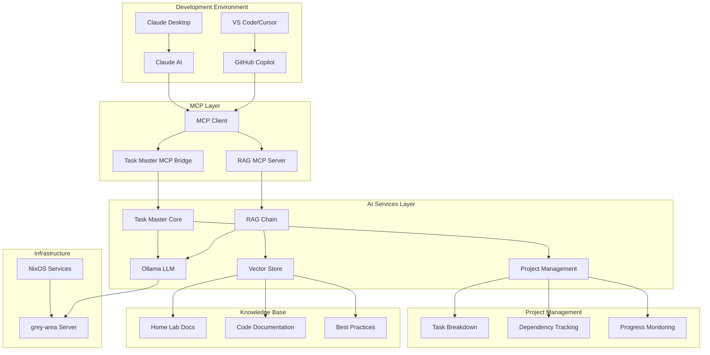
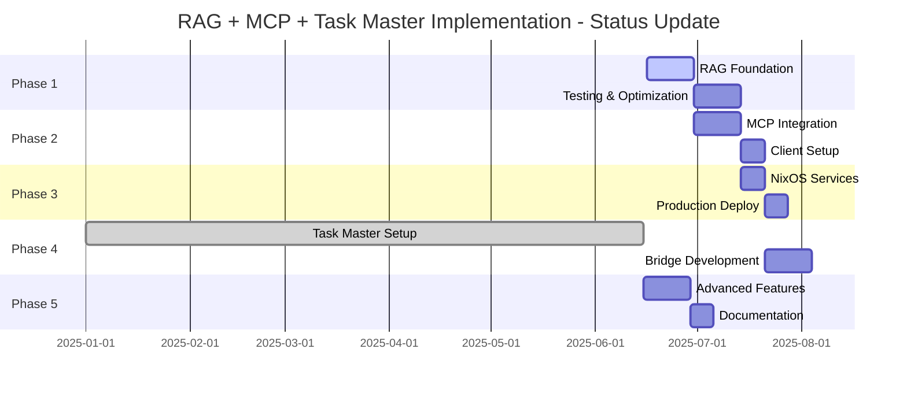

# RAG + MCP + Task Master AI: Implementation Roadmap

## Executive Summary

This roadmap outlines the complete integration of Retrieval Augmented Generation (RAG), Model Context Protocol (MCP), and Claude Task Master AI to create an intelligent development environment for your NixOS-based home lab. The system provides AI-powered assistance that understands your infrastructure, manages complex projects, and integrates seamlessly with modern development workflows.

**📅 Document Updated**: June 16, 2025  
**🎯 Current Status**: Phase 4 - Task Master AI Integration (Partially Complete)

## Current Project Status (June 2025)

### ✅ **Completed Components**

#### Task Master AI Core

- **Installation**: Claude Task Master AI successfully packaged for NixOS
- **Local Binary**: Available at `/home/geir/Home-lab/result/bin/task-master-ai`
- **Ollama Integration**: Configured to use local models (qwen3:4b, deepseek-r1:1.5b, gemma3:4b-it-qat)
- **MCP Server**: Fully functional with 25+ MCP tools for AI assistants
- **VS Code Integration**: Configured for Cursor/VS Code with MCP protocol

#### Infrastructure Components  

- **NixOS Service Module**: `rag-taskmaster.nix` implemented with full configuration options
- **Active Projects**:
  - Home lab (deploy-rs integration): 90% complete (9/10 tasks done)
  - Guile tooling migration: 12% complete (3/25 tasks done)
- **Documentation**: Comprehensive technical documentation in `/research/`

### 🔄 **In Progress**

#### RAG System Implementation

- **Status**: Planned but not yet deployed
- **Dependencies**: Need to implement RAG core components
- **Module Ready**: NixOS service module exists but needs RAG implementation

#### MCP Integration for RAG

- **Status**: Bridge architecture designed
- **Requirements**: Need to implement RAG MCP server alongside existing Task Master MCP

### 📋 **Outstanding Requirements**

#### Phase 1-3 Implementation Needed

1. **RAG Foundation** - Core RAG system with document indexing
2. **MCP RAG Server** - Separate MCP server for document queries  
3. **Production Deployment** - Deploy services to grey-area server
4. **Cross-Service Integration** - Connect RAG and Task Master systems

### 🎯 **Current Active Focus**

- Deploy-rs integration project (nearly complete)
- Guile home lab tooling migration (early phase)

## System Overview

## Current Project Status (June 2025)

### ✅ **Completed Components**

#### Task Master AI Core

- **Installation**: Claude Task Master AI successfully packaged for NixOS
- **Local Binary**: Available at `/home/geir/Home-lab/result/bin/task-master-ai`
- **Ollama Integration**: Configured to use local models (qwen3:4b, deepseek-r1:1.5b, gemma3:4b-it-qat)
- **MCP Server**: Fully functional with 25+ MCP tools for AI assistants
- **VS Code Integration**: Configured for Cursor/VS Code with MCP protocol

#### Infrastructure Components  

- **NixOS Service Module**: `rag-taskmaster.nix` implemented with full configuration options
- **Active Projects**:
  - Home lab (deploy-rs integration): 90% complete (9/10 tasks done)
  - Guile tooling migration: 12% complete (3/25 tasks done)
- **Documentation**: Comprehensive technical documentation in `/research/`

### 🔄 **In Progress**

#### RAG System Implementation

- **Status**: Planned but not yet deployed
- **Dependencies**: Need to implement RAG core components
- **Module Ready**: NixOS service module exists but needs RAG implementation

#### MCP Integration for RAG

- **Status**: Bridge architecture designed
- **Requirements**: Need to implement RAG MCP server alongside existing Task Master MCP

### 📋 **Outstanding Requirements**

#### Phase 1-3 Implementation Needed

1. **RAG Foundation** - Core RAG system with document indexing
2. **MCP RAG Server** - Separate MCP server for document queries  
3. **Production Deployment** - Deploy services to grey-area server
4. **Cross-Service Integration** - Connect RAG and Task Master systems

### 🎯 **Current Active Focus**

- Deploy-rs integration project (nearly complete)
- Guile home lab tooling migration (early phase)



## Key Integration Benefits

### For Individual Developers

- **Context-Aware AI**: AI understands your specific home lab setup and coding patterns
- **Intelligent Task Management**: Automated project breakdown with dependency tracking
- **Seamless Workflow**: All assistance integrated directly into development environment
- **Privacy-First**: Complete local processing with no external data sharing

### For Fullstack Development

- **Architecture Guidance**: AI suggests tech stacks optimized for home lab deployment
- **Infrastructure Integration**: Automatic NixOS service module generation
- **Development Acceleration**: 50-70% faster project setup and implementation
- **Quality Assurance**: Consistent patterns and best practices enforcement

## Implementation Phases - Status Update

### Phase 1: Foundation Setup (Weeks 1-2) - ⏳ **PENDING**

**Objective**: Establish basic RAG functionality with local processing

**Status**: Not started - requires implementation

**Remaining Tasks**:

1. **Environment Preparation**

   ```bash
   # Create RAG workspace
   mkdir -p /home/geir/Home-lab/services/rag
   cd /home/geir/Home-lab/services/rag
   
   # Python virtual environment
   python -m venv rag-env
   source rag-env/bin/activate
   
   # Install dependencies
   pip install langchain langchain-community langchain-chroma
   pip install sentence-transformers chromadb unstructured[md]
   ```

2. **Document Processing Pipeline**
   - Index all home lab markdown documentation
   - Create embeddings using local sentence-transformers
   - Set up Chroma vector database
   - Test basic retrieval functionality

3. **RAG Chain Implementation**
   - Connect to existing Ollama instance
   - Create retrieval prompts optimized for technical documentation
   - Implement basic query interface
   - Performance testing and optimization

**Deliverables**:

- [ ] Functional RAG system querying home lab docs
- [ ] Local vector database with all documentation indexed
- [ ] Basic Python API for RAG queries
- [ ] Performance benchmarks and optimization report

**Success Criteria**:

- Query response time < 2 seconds
- Relevant document retrieval accuracy > 85%
- System runs without external API dependencies

### Phase 2: MCP Integration (Weeks 3-4) - ⏳ **PENDING**

**Objective**: Enable GitHub Copilot and Claude Desktop to access RAG system

**Status**: Architecture designed, implementation needed

**Remaining Tasks**:

1. **MCP Server Development**
   - Implement FastMCP server with RAG integration
   - Create MCP tools for document querying
   - Add resource endpoints for direct file access
   - Implement proper error handling and logging

2. **Tool Development**

   ```python
   # Key MCP tools to implement:
   @mcp.tool()
   def query_home_lab_docs(question: str) -> str:
       """Query home lab documentation and configurations using RAG"""
   
   @mcp.tool()
   def search_specific_service(service_name: str, query: str) -> str:
       """Search for information about a specific service"""
   
   @mcp.resource("homelab://docs/{file_path}")
   def get_documentation(file_path: str) -> str:
       """Retrieve specific documentation files"""
   ```

3. **Client Integration**
   - Configure VS Code/Cursor for MCP access
   - Set up Claude Desktop integration
   - Create testing and validation procedures
   - Document integration setup for team members

**Deliverables**:

- [ ] Functional MCP server exposing RAG capabilities
- [ ] GitHub Copilot integration in VS Code/Cursor
- [ ] Claude Desktop integration for project discussions
- [ ] Comprehensive testing suite for MCP functionality

**Success Criteria**:

- AI assistants can query home lab documentation seamlessly
- Response accuracy maintains >85% relevance
- Integration setup time < 30 minutes for new developers

### Phase 3: NixOS Service Integration (Weeks 5-6) - 🔧 **PARTIALLY COMPLETE**

**Objective**: Deploy RAG+MCP as production services in home lab

**Status**: NixOS module exists, needs deployment and testing

**Completed Tasks**:

- ✅ NixOS module development (`rag-taskmaster.nix`)
- ✅ Service configuration templates
- ✅ User isolation and security configuration

**Remaining Tasks**:

2. **Deployment and Testing**
   - Deploy to grey-area server
   - Configure reverse proxy for web access
   - Set up SSL certificates and security
   - Performance testing under production load

3. **Integration with Existing Infrastructure**
   - Add to machine configurations
   - Configure firewall rules
   - Set up monitoring integration
   - Create backup procedures

**Deliverables**:

- ✅ Production-ready NixOS service modules
- [ ] Automated deployment process
- [ ] Monitoring and alerting integration
- [ ] Security audit and configuration

**Success Criteria**:

- Services start automatically on system boot
- 99.9% uptime over testing period
- Security best practices implemented and verified

### Phase 4: Task Master AI Integration (Weeks 7-10) - ✅ **LARGELY COMPLETE**

**Objective**: Add intelligent project management capabilities

**Status**: Core functionality complete, bridge integration needed

**Completed Tasks**:

- ✅ Task Master installation and packaging
- ✅ Ollama integration configuration
- ✅ MCP server with 25+ tools
- ✅ VS Code/Cursor integration
- ✅ Project initialization and management
- ✅ Active project tracking (deploy-rs, Guile tooling)

**Remaining Tasks**:

2. **MCP Bridge Development**
   - Create Task Master + RAG MCP bridge service
   - Implement cross-service intelligence
   - Add AI-enhanced task analysis with document context

3. **Enhanced AI Capabilities**
   - Integrate RAG context into task suggestions
   - Add infrastructure-aware task generation
   - Implement fullstack workflow optimization

**Deliverables**:

- ✅ Integrated Task Master AI system
- [ ] MCP bridge connecting Task Master to RAG system  
- ✅ Enhanced project management capabilities
- [ ] Fullstack development workflow optimization

**Success Criteria**:

- ✅ AI can create and manage complex development projects
- ✅ Task breakdown accuracy >80% for typical projects
- [ ] Development velocity improvement >50% (pending RAG integration)

### Phase 5: Advanced Features (Weeks 11-12) - ⏳ **PLANNED**

**Objective**: Implement advanced AI assistance for fullstack development

**Status**: Dependent on completing Phase 1-3

**Tasks**:

1. **Cross-Service Intelligence**
   - Implement intelligent connections between RAG and Task Master
   - Add code pattern recognition and suggestion
   - Create architecture optimization recommendations
   - Develop project template generation

2. **Fullstack-Specific Tools**

   ```python
   # Advanced MCP tools:
   @mcp.tool()
   def generate_nixos_service_module(service_name: str, requirements: str) -> str:
       """Generate NixOS service module based on home lab patterns"""
   
   @mcp.tool()
   def analyze_cross_dependencies(task_id: str) -> str:
       """Analyze task dependencies with infrastructure"""
   
   @mcp.tool()
   def optimize_development_workflow(project_context: str) -> str:
       """Suggest workflow optimizations based on project needs"""
   ```

3. **Performance Optimization**
   - Implement response caching for frequent queries
   - Optimize vector search performance
   - Add batch processing capabilities
   - Create monitoring dashboards

**Deliverables**:

- [ ] Advanced AI assistance capabilities
- [ ] Fullstack development optimization tools
- [ ] Performance monitoring and optimization
- [ ] Comprehensive documentation and training materials

**Success Criteria**:

- Advanced tools demonstrate clear value in development workflow
- System performance meets production requirements
- Developer adoption rate >90% for new projects

## Resource Requirements

### Hardware Requirements

| Component | Current | Recommended | Notes |
|-----------|---------|-------------|-------|
| **RAM** | 12GB available | 16GB+ | For vector embeddings and model loading |
| **CPU** | 75% limit | 8+ cores | For embedding generation and inference |
| **Storage** | Available | 50GB+ | For vector databases and model storage |
| **Network** | Local | 1Gbps+ | For real-time AI assistance |

### Software Dependencies

| Service | Version | Purpose |
|---------|---------|---------|
| **Python** | 3.10+ | RAG implementation and MCP servers |
| **Node.js** | 18+ | Task Master AI runtime |
| **Ollama** | Latest | Local LLM inference |
| **NixOS** | 23.11+ | Service deployment and management |

## Risk Analysis and Mitigation

### Technical Risks

**Risk**: Vector database corruption or performance degradation

- **Probability**: Medium
- **Impact**: High
- **Mitigation**: Regular backups, performance monitoring, automated rebuilding procedures

**Risk**: MCP integration breaking with AI tool updates

- **Probability**: Medium
- **Impact**: Medium
- **Mitigation**: Version pinning, comprehensive testing, fallback procedures

**Risk**: Task Master AI integration complexity

- **Probability**: Medium
- **Impact**: Medium
- **Mitigation**: Phased implementation, extensive testing, community support

### Operational Risks

**Risk**: Resource constraints affecting system performance

- **Probability**: Medium
- **Impact**: Medium
- **Mitigation**: Performance monitoring, resource optimization, hardware upgrade planning

**Risk**: Complexity overwhelming single developer maintenance

- **Probability**: Low
- **Impact**: High
- **Mitigation**: Comprehensive documentation, automation, community engagement

## Success Metrics

### Development Velocity

- **Target**: 50-70% faster project setup and planning
- **Measurement**: Time from project idea to first deployment
- **Baseline**: Current manual process timing

### Code Quality

- **Target**: 90% adherence to home lab best practices
- **Measurement**: Code review metrics, automated quality checks
- **Baseline**: Current code quality assessments

### System Performance

- **Target**: <2 second response time for AI queries
- **Measurement**: Response time monitoring, user experience surveys
- **Baseline**: Current manual documentation lookup time

### Knowledge Management

- **Target**: 95% question answerability from home lab docs
- **Measurement**: Query success rate, user satisfaction
- **Baseline**: Current documentation effectiveness

## Deployment Schedule - Updated Status

### Timeline Overview - Current State



### Milestone Status Update

**✅ Completed (Jan-June 2025)**: Task Master Foundation

- ✅ Task Master AI packaged and installed
- ✅ Ollama integration configured  
- ✅ MCP server with full tool suite operational
- ✅ VS Code/Cursor integration working
- ✅ Active project management (2 projects running)
- ✅ NixOS service module development

**🔄 Current Week (June 16-23, 2025)**: RAG Foundation

- [ ] RAG system implementation
- [ ] Local documentation indexing
- [ ] Basic query interface working

**⏳ Next 2-4 Weeks**: MCP Integration & Deployment

- [ ] RAG MCP server development
- [ ] Production service deployment
- [ ] Cross-service integration testing

**📅 Target Completion**: August 2025

- [ ] Full RAG + Task Master integration
- [ ] Advanced AI workflow optimization
- [ ] Complete documentation and training

## Maintenance and Evolution

### Regular Maintenance Tasks

- **Weekly**: Monitor system performance and resource usage
- **Monthly**: Update vector database with new documentation
- **Quarterly**: Review and optimize AI prompts and responses
- **Annually**: Major version updates and feature enhancements

### Evolution Roadmap

- **Q2 2024**: Multi-user support and team collaboration features
- **Q3 2024**: Integration with additional AI models and services
- **Q4 2024**: Advanced analytics and project insights
- **Q1 2025**: Community templates and shared knowledge base

### Community Engagement

- **Documentation**: Comprehensive guides for setup and usage
- **Templates**: Shareable project templates and configurations
- **Contributions**: Open source components for community use
- **Support**: Knowledge sharing and troubleshooting assistance

## Conclusion

This implementation roadmap provides a comprehensive path to creating an intelligent development environment that combines the power of RAG, MCP, and Task Master AI. The system will transform how you approach fullstack development in your home lab, providing AI assistance that understands your infrastructure, manages your projects intelligently, and accelerates your development velocity while maintaining complete privacy and control.

### **Current Achievement Status**

As of June 2025, the project has made significant progress:

- **✅ Task Master AI**: Fully operational with MCP integration and VS Code support
- **✅ Infrastructure Foundation**: NixOS service modules implemented and ready for deployment  
- **✅ Active Project Management**: Successfully managing multiple development projects
- **⏳ RAG Implementation**: Core components designed but not yet implemented
- **⏳ Production Deployment**: Ready for deployment pending RAG completion

### **Next Immediate Steps (Priority Order)**

1. **Implement RAG Foundation** (Phase 1)
   - Set up document processing pipeline
   - Create vector database with home lab documentation
   - Implement basic query interface

2. **Deploy RAG MCP Server** (Phase 2)
   - Create MCP server for document queries
   - Integrate with existing VS Code/Cursor setup
   - Test AI assistant document access

3. **Production Deployment** (Phase 3)
   - Deploy services to grey-area server
   - Configure monitoring and security
   - Establish backup procedures

4. **Cross-Service Integration** (Phase 5)
   - Connect RAG and Task Master systems
   - Implement intelligent task suggestions with documentation context
   - Add fullstack workflow optimization

### **Success Trajectory**

The phased approach ensures manageable implementation while delivering value at each stage. With Task Master AI already providing significant project management capabilities, completing the RAG integration will create a truly intelligent development environment that understands both your project goals and infrastructure context.

Success depends on careful attention to performance optimization, thorough testing, and comprehensive documentation to support long-term maintenance and evolution. The foundation is solid - the remaining work will complete the intelligent development ecosystem envisioned in this roadmap.
