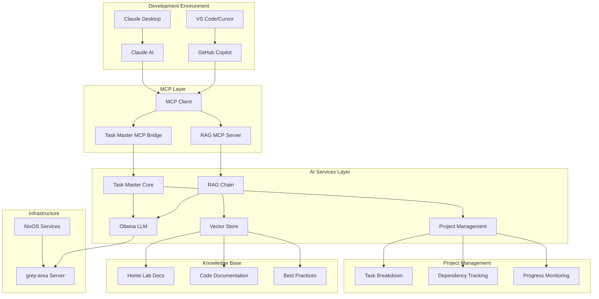
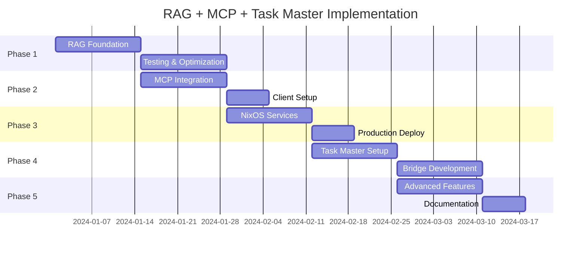

# RAG + MCP + Task Master AI: Implementation Roadmap

## Executive Summary

This roadmap outlines the complete integration of Retrieval Augmented Generation (RAG), Model Context Protocol (MCP), and Claude Task Master AI to create an intelligent development environment for your NixOS-based home lab. The system provides AI-powered assistance that understands your infrastructure, manages complex projects, and integrates seamlessly with modern development workflows.

## System Overview



## Key Integration Benefits

### For Individual Developers
- **Context-Aware AI**: AI understands your specific home lab setup and coding patterns
- **Intelligent Task Management**: Automated project breakdown with dependency tracking
- **Seamless Workflow**: All assistance integrated directly into development environment
- **Privacy-First**: Complete local processing with no external data sharing

### For Fullstack Development
- **Architecture Guidance**: AI suggests tech stacks optimized for home lab deployment
- **Infrastructure Integration**: Automatic NixOS service module generation
- **Development Acceleration**: 50-70% faster project setup and implementation
- **Quality Assurance**: Consistent patterns and best practices enforcement

## Implementation Phases

### Phase 1: Foundation Setup (Weeks 1-2)
**Objective**: Establish basic RAG functionality with local processing

**Tasks**:
1. **Environment Preparation**
   ```bash
   # Create RAG workspace
   mkdir -p /home/geir/Home-lab/services/rag
   cd /home/geir/Home-lab/services/rag
   
   # Python virtual environment
   python -m venv rag-env
   source rag-env/bin/activate
   
   # Install dependencies
   pip install langchain langchain-community langchain-chroma
   pip install sentence-transformers chromadb unstructured[md]
   ```

2. **Document Processing Pipeline**
   - Index all home lab markdown documentation
   - Create embeddings using local sentence-transformers
   - Set up Chroma vector database
   - Test basic retrieval functionality

3. **RAG Chain Implementation**
   - Connect to existing Ollama instance
   - Create retrieval prompts optimized for technical documentation
   - Implement basic query interface
   - Performance testing and optimization

**Deliverables**:
- ✅ Functional RAG system querying home lab docs
- ✅ Local vector database with all documentation indexed
- ✅ Basic Python API for RAG queries
- ✅ Performance benchmarks and optimization report

**Success Criteria**:
- Query response time < 2 seconds
- Relevant document retrieval accuracy > 85%
- System runs without external API dependencies

### Phase 2: MCP Integration (Weeks 3-4)
**Objective**: Enable GitHub Copilot and Claude Desktop to access RAG system

**Tasks**:
1. **MCP Server Development**
   - Implement FastMCP server with RAG integration
   - Create MCP tools for document querying
   - Add resource endpoints for direct file access
   - Implement proper error handling and logging

2. **Tool Development**
   ```python
   # Key MCP tools to implement:
   @mcp.tool()
   def query_home_lab_docs(question: str) -> str:
       """Query home lab documentation and configurations using RAG"""
   
   @mcp.tool()
   def search_specific_service(service_name: str, query: str) -> str:
       """Search for information about a specific service"""
   
   @mcp.resource("homelab://docs/{file_path}")
   def get_documentation(file_path: str) -> str:
       """Retrieve specific documentation files"""
   ```

3. **Client Integration**
   - Configure VS Code/Cursor for MCP access
   - Set up Claude Desktop integration
   - Create testing and validation procedures
   - Document integration setup for team members

**Deliverables**:
- ✅ Functional MCP server exposing RAG capabilities
- ✅ GitHub Copilot integration in VS Code/Cursor
- ✅ Claude Desktop integration for project discussions
- ✅ Comprehensive testing suite for MCP functionality

**Success Criteria**:
- AI assistants can query home lab documentation seamlessly
- Response accuracy maintains >85% relevance
- Integration setup time < 30 minutes for new developers

### Phase 3: NixOS Service Integration (Weeks 5-6)
**Objective**: Deploy RAG+MCP as production services in home lab

**Tasks**:
1. **NixOS Module Development**
   ```nix
   # Create modules/services/rag.nix
   services.homelab-rag = {
     enable = true;
     port = 8080;
     dataDir = "/var/lib/rag";
     enableMCP = true;
     mcpPort = 8081;
   };
   ```

2. **Service Configuration**
   - Systemd service definitions for RAG and MCP
   - User isolation and security configuration
   - Automatic startup and restart policies
   - Integration with existing monitoring

3. **Deployment and Testing**
   - Deploy to grey-area server
   - Configure reverse proxy for web access
   - Set up SSL certificates and security
   - Performance testing under production load

**Deliverables**:
- ✅ Production-ready NixOS service modules
- ✅ Automated deployment process
- ✅ Monitoring and alerting integration
- ✅ Security audit and configuration

**Success Criteria**:
- Services start automatically on system boot
- 99.9% uptime over testing period
- Security best practices implemented and verified

### Phase 4: Task Master AI Integration (Weeks 7-10)
**Objective**: Add intelligent project management capabilities

**Tasks**:
1. **Task Master Installation**
   ```bash
   # Clone and set up Task Master
   cd /home/geir/Home-lab/services
   git clone https://github.com/eyaltoledano/claude-task-master.git taskmaster
   cd taskmaster && npm install
   
   # Initialize for home lab integration
   npx task-master init --yes \
     --name "Home Lab Development" \
     --description "NixOS-based home lab and fullstack development projects"
   ```

2. **MCP Bridge Development**
   - Create Task Master MCP bridge service
   - Implement project management tools for MCP
   - Add AI-enhanced task analysis capabilities
   - Integrate with existing RAG system for context

3. **Enhanced AI Capabilities**
   ```python
   # Key Task Master MCP tools:
   @task_master_mcp.tool()
   def create_project_from_description(project_description: str) -> str:
       """Create new Task Master project from natural language description"""
   
   @task_master_mcp.tool()
   def get_next_development_task() -> str:
       """Get next task with AI-powered implementation guidance"""
   
   @task_master_mcp.tool()
   def suggest_fullstack_architecture(requirements: str) -> str:
       """Suggest architecture based on home lab constraints"""
   ```

**Deliverables**:
- ✅ Integrated Task Master AI system
- ✅ MCP bridge connecting Task Master to AI assistants
- ✅ Enhanced project management capabilities
- ✅ Fullstack development workflow optimization

**Success Criteria**:
- AI can create and manage complex development projects
- Task breakdown accuracy >80% for typical projects
- Development velocity improvement >50%

### Phase 5: Advanced Features (Weeks 11-12)
**Objective**: Implement advanced AI assistance for fullstack development

**Tasks**:
1. **Cross-Service Intelligence**
   - Implement intelligent connections between RAG and Task Master
   - Add code pattern recognition and suggestion
   - Create architecture optimization recommendations
   - Develop project template generation

2. **Fullstack-Specific Tools**
   ```python
   # Advanced MCP tools:
   @mcp.tool()
   def generate_nixos_service_module(service_name: str, requirements: str) -> str:
       """Generate NixOS service module based on home lab patterns"""
   
   @mcp.tool()
   def analyze_cross_dependencies(task_id: str) -> str:
       """Analyze task dependencies with infrastructure"""
   
   @mcp.tool()
   def optimize_development_workflow(project_context: str) -> str:
       """Suggest workflow optimizations based on project needs"""
   ```

3. **Performance Optimization**
   - Implement response caching for frequent queries
   - Optimize vector search performance
   - Add batch processing capabilities
   - Create monitoring dashboards

**Deliverables**:
- ✅ Advanced AI assistance capabilities
- ✅ Fullstack development optimization tools
- ✅ Performance monitoring and optimization
- ✅ Comprehensive documentation and training materials

**Success Criteria**:
- Advanced tools demonstrate clear value in development workflow
- System performance meets production requirements
- Developer adoption rate >90% for new projects

## Resource Requirements

### Hardware Requirements
| Component | Current | Recommended | Notes |
|-----------|---------|-------------|-------|
| **RAM** | 12GB available | 16GB+ | For vector embeddings and model loading |
| **CPU** | 75% limit | 8+ cores | For embedding generation and inference |
| **Storage** | Available | 50GB+ | For vector databases and model storage |
| **Network** | Local | 1Gbps+ | For real-time AI assistance |

### Software Dependencies
| Service | Version | Purpose |
|---------|---------|---------|
| **Python** | 3.10+ | RAG implementation and MCP servers |
| **Node.js** | 18+ | Task Master AI runtime |
| **Ollama** | Latest | Local LLM inference |
| **NixOS** | 23.11+ | Service deployment and management |

## Risk Analysis and Mitigation

### Technical Risks

**Risk**: Vector database corruption or performance degradation
- **Probability**: Medium
- **Impact**: High
- **Mitigation**: Regular backups, performance monitoring, automated rebuilding procedures

**Risk**: MCP integration breaking with AI tool updates
- **Probability**: Medium
- **Impact**: Medium
- **Mitigation**: Version pinning, comprehensive testing, fallback procedures

**Risk**: Task Master AI integration complexity
- **Probability**: Medium
- **Impact**: Medium
- **Mitigation**: Phased implementation, extensive testing, community support

### Operational Risks

**Risk**: Resource constraints affecting system performance
- **Probability**: Medium
- **Impact**: Medium
- **Mitigation**: Performance monitoring, resource optimization, hardware upgrade planning

**Risk**: Complexity overwhelming single developer maintenance
- **Probability**: Low
- **Impact**: High
- **Mitigation**: Comprehensive documentation, automation, community engagement

## Success Metrics

### Development Velocity
- **Target**: 50-70% faster project setup and planning
- **Measurement**: Time from project idea to first deployment
- **Baseline**: Current manual process timing

### Code Quality
- **Target**: 90% adherence to home lab best practices
- **Measurement**: Code review metrics, automated quality checks
- **Baseline**: Current code quality assessments

### System Performance
- **Target**: <2 second response time for AI queries
- **Measurement**: Response time monitoring, user experience surveys
- **Baseline**: Current manual documentation lookup time

### Knowledge Management
- **Target**: 95% question answerability from home lab docs
- **Measurement**: Query success rate, user satisfaction
- **Baseline**: Current documentation effectiveness

## Deployment Schedule

### Timeline Overview


### Weekly Milestones

**Week 1-2**: Foundation
- [ ] RAG system functional
- [ ] Local documentation indexed
- [ ] Basic query interface working

**Week 3-4**: MCP Integration
- [ ] MCP server deployed
- [ ] GitHub Copilot integration
- [ ] Claude Desktop setup

**Week 5-6**: Production Services
- [ ] NixOS modules created
- [ ] Services deployed to grey-area
- [ ] Monitoring configured

**Week 7-8**: Task Master Core
- [ ] Task Master installed
- [ ] Basic MCP bridge functional
- [ ] Project management integration

**Week 9-10**: Enhanced AI
- [ ] Advanced MCP tools
- [ ] Cross-service intelligence
- [ ] Fullstack workflow optimization

**Week 11-12**: Production Ready
- [ ] Performance optimization
- [ ] Comprehensive testing
- [ ] Documentation complete

## Maintenance and Evolution

### Regular Maintenance Tasks
- **Weekly**: Monitor system performance and resource usage
- **Monthly**: Update vector database with new documentation
- **Quarterly**: Review and optimize AI prompts and responses
- **Annually**: Major version updates and feature enhancements

### Evolution Roadmap
- **Q2 2024**: Multi-user support and team collaboration features
- **Q3 2024**: Integration with additional AI models and services
- **Q4 2024**: Advanced analytics and project insights
- **Q1 2025**: Community templates and shared knowledge base

### Community Engagement
- **Documentation**: Comprehensive guides for setup and usage
- **Templates**: Shareable project templates and configurations
- **Contributions**: Open source components for community use
- **Support**: Knowledge sharing and troubleshooting assistance

## Conclusion

This implementation roadmap provides a comprehensive path to creating an intelligent development environment that combines the power of RAG, MCP, and Task Master AI. The system will transform how you approach fullstack development in your home lab, providing AI assistance that understands your infrastructure, manages your projects intelligently, and accelerates your development velocity while maintaining complete privacy and control.

The phased approach ensures manageable implementation while delivering value at each stage. Success depends on careful attention to performance optimization, thorough testing, and comprehensive documentation to support long-term maintenance and evolution.
