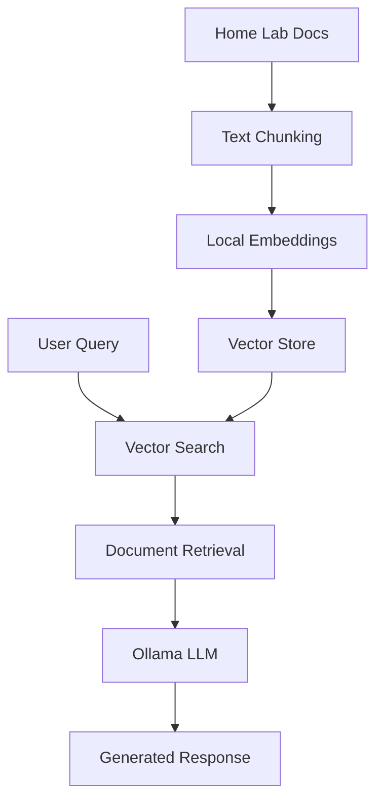
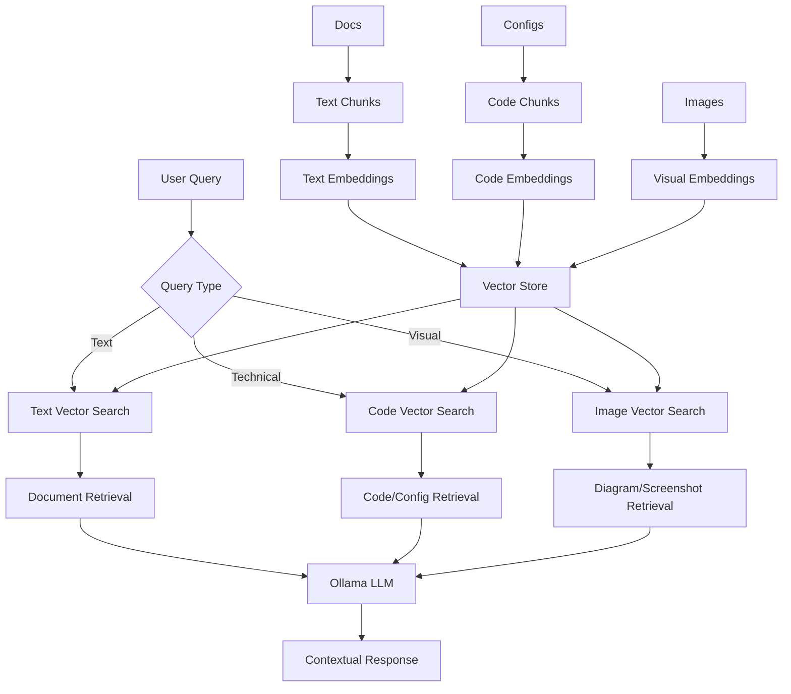
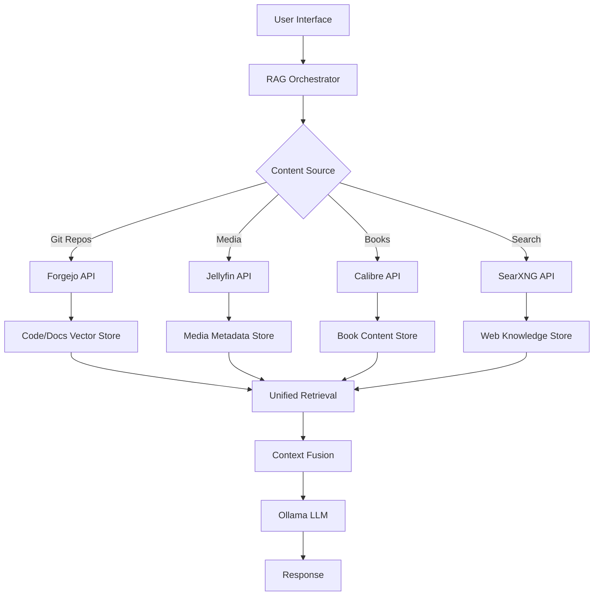
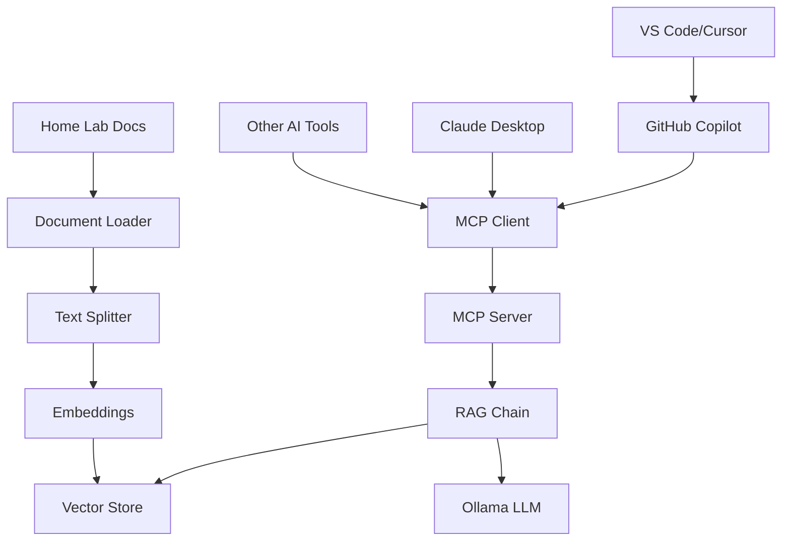
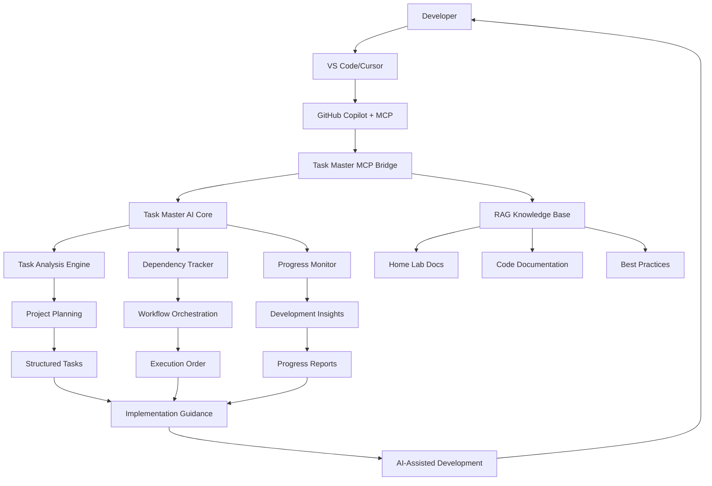

# RAG (Retrieval Augmented Generation) Integration for Home Lab

## Overview

Retrieval Augmented Generation (RAG) is an AI architecture pattern that combines the power of Large Language Models (LLMs) with external knowledge retrieval systems. Instead of relying solely on the model's training data, RAG systems can access and incorporate real-time information from external sources, making responses more accurate, current, and contextually relevant.

This document outlines a comprehensive RAG implementation integrated with:
- **Model Context Protocol (MCP)** for GitHub Copilot integration
- **Claude Task Master AI** for intelligent project management
- **Fullstack Web Development Workflows** for modern development practices

The system provides AI-powered development assistance that understands your home lab infrastructure, manages complex development tasks, and integrates seamlessly with your coding workflow.

## What is RAG?

RAG works by:
1. **Indexing**: Documents are split into chunks, embedded into vectors, and stored in a vector database
2. **Retrieval**: When a query comes in, relevant document chunks are retrieved using semantic similarity search
3. **Generation**: The LLM generates a response using both the original query and the retrieved context

### Key Benefits
- **Up-to-date Information**: Access to current data beyond training cutoffs
- **Reduced Hallucinations**: Grounded responses based on actual documents
- **Domain Expertise**: Can be specialized with your own documentation/knowledge
- **Cost Effective**: No need to retrain models with new information

## Current Home Lab Infrastructure Analysis

### Existing Assets

#### 1. Ollama Setup (grey-area server)
- **Models Available**:
  - `llama3.3:8b` (4.7GB) - General purpose, excellent reasoning
  - `codellama:7b` (3.8GB) - Code-focused assistance
  - `mistral:7b` (4.1GB) - Fast inference, balanced performance
- **API**: OpenAI-compatible REST API on `localhost:11434`
- **Resources**: 12GB memory limit, 75% CPU limit
- **Status**: Fully deployed and operational

#### 2. Available Services
- **Forgejo**: Git repository hosting with extensive documentation
- **Jellyfin**: Media server with metadata
- **Calibre-web**: E-book management system
- **SearXNG**: Private search engine
- **NFS**: Network file sharing

#### 3. Documentation Base
Your home lab contains extensive documentation that would be perfect for RAG:
- NixOS configurations and modules
- Service deployment guides
- Network configurations
- Development workflows
- CLI tools documentation
- ZFS setup guides

## RAG Integration Architectures

### Option 1: Simple Local RAG (Recommended Start)



**Components**:
- **Vector Store**: Chroma (local, persistent)
- **Embeddings**: sentence-transformers (local, no API keys)
- **LLM**: Your existing Ollama models
- **Documents**: Your home lab documentation

**Advantages**:
- Completely self-hosted
- No external API dependencies
- Works with existing infrastructure
- Privacy-focused

### Option 2: Enhanced RAG with Multi-Modal Support



### Option 3: Distributed RAG Across Services



## Implementation Roadmap

### Phase 1: Basic RAG Setup (Week 1-2)

#### 1.1 Environment Setup
```bash
# Create dedicated RAG workspace
mkdir -p /home/geir/Home-lab/services/rag
cd /home/geir/Home-lab/services/rag

# Python virtual environment
python -m venv rag-env
source rag-env/bin/activate

# Install core dependencies
pip install langchain langchain-community langchain-chroma
pip install sentence-transformers chromadb
pip install unstructured[md] # For markdown parsing
```

#### 1.2 Document Processing Pipeline
```python
# Document loader for your home lab docs
from langchain_community.document_loaders import DirectoryLoader
from langchain_text_splitters import RecursiveCharacterTextSplitter
from langchain_chroma import Chroma
from langchain_community.embeddings import SentenceTransformerEmbeddings

# Load all markdown files
loader = DirectoryLoader(
    "/home/geir/Home-lab", 
    glob="**/*.md",
    show_progress=True
)
docs = loader.load()

# Split into chunks
text_splitter = RecursiveCharacterTextSplitter(
    chunk_size=1000,
    chunk_overlap=200
)
splits = text_splitter.split_documents(docs)

# Create embeddings (local, no API needed)
embeddings = SentenceTransformerEmbeddings(
    model_name="all-MiniLM-L6-v2"
)

# Create vector store
vectorstore = Chroma.from_documents(
    documents=splits,
    embedding=embeddings,
    persist_directory="./chroma_db"
)
```

#### 1.3 Basic RAG Chain
```python
from langchain_core.prompts import ChatPromptTemplate
from langchain_community.llms import Ollama
from langchain_core.runnables import RunnablePassthrough
from langchain_core.output_parsers import StrOutputParser

# Connect to your Ollama instance
llm = Ollama(
    model="llama3.3:8b",
    base_url="http://grey-area:11434"  # or localhost if running locally
)

# Create RAG prompt
template = """Answer the question based on the following context from the home lab documentation:

Context: {context}

Question: {question}

Answer based on the home lab context. If the information isn't in the context, say so clearly."""

prompt = ChatPromptTemplate.from_template(template)

# Create retriever
retriever = vectorstore.as_retriever(search_kwargs={"k": 3})

# RAG chain
rag_chain = (
    {"context": retriever, "question": RunnablePassthrough()}
    | prompt
    | llm
    | StrOutputParser()
)

# Test it
response = rag_chain.invoke("How do I deploy Ollama in the home lab?")
print(response)
```

### Phase 2: NixOS Integration (Week 3)

#### 2.1 Create NixOS Service Module
Create `modules/services/rag.nix`:

```nix
{ config, lib, pkgs, ... }:
with lib;
let
  cfg = config.services.homelab-rag;
  ragApp = pkgs.python3.withPackages (ps: with ps; [
    langchain
    langchain-community
    chromadb
    sentence-transformers
    fastapi
    uvicorn
  ]);
in {
  options.services.homelab-rag = {
    enable = mkEnableOption "Home Lab RAG Service";
    
    port = mkOption {
      type = types.port;
      default = 8080;
      description = "Port for RAG API";
    };
    
    dataDir = mkOption {
      type = types.path;
      default = "/var/lib/rag";
      description = "Directory for RAG data and vector store";
    };
    
    updateInterval = mkOption {
      type = types.str;
      default = "1h";
      description = "How often to update the document index";
    };
  };

  config = mkIf cfg.enable {
    systemd.services.homelab-rag = {
      description = "Home Lab RAG Service";
      wantedBy = [ "multi-user.target" ];
      after = [ "network.target" ];
      
      serviceConfig = {
        Type = "simple";
        User = "rag";
        Group = "rag";
        WorkingDirectory = cfg.dataDir;
        ExecStart = "${ragApp}/bin/python -m rag_service";
        Restart = "always";
        RestartSec = 10;
      };
      
      environment = {
        OLLAMA_BASE_URL = "http://localhost:11434";
        VECTOR_STORE_PATH = "${cfg.dataDir}/chroma_db";
        DOCS_PATH = "/home/geir/Home-lab";
      };
    };

    users.users.rag = {
      isSystemUser = true;
      group = "rag";
      home = cfg.dataDir;
      createHome = true;
    };
    
    users.groups.rag = {};
    
    # Document indexing timer
    systemd.timers.rag-index-update = {
      wantedBy = [ "timers.target" ];
      timerConfig = {
        OnCalendar = cfg.updateInterval;
        Persistent = true;
      };
    };
    
    systemd.services.rag-index-update = {
      description = "Update RAG document index";
      serviceConfig = {
        Type = "oneshot";
        User = "rag";
        ExecStart = "${ragApp}/bin/python -m rag_indexer";
      };
    };
  };
}
```

#### 2.2 Add to System Configuration
In your `grey-area/configuration.nix`:

```nix
imports = [
  # ...existing imports...
  ../modules/services/rag.nix
];

services.homelab-rag = {
  enable = true;
  port = 8080;
  updateInterval = "30m"; # Update every 30 minutes
};

# Open firewall for RAG service
networking.firewall.allowedTCPPorts = [ 8080 ];
```

### Phase 3: Advanced Features (Week 4-6)

#### 3.1 Multi-Source RAG
Integrate with existing services:

```python
# Forgejo integration
from langchain_community.document_loaders import GitLoader

class ForgejoRAGLoader:
    def __init__(self, forgejo_url, api_token):
        self.forgejo_url = forgejo_url
        self.api_token = api_token
    
    def load_repositories(self):
        # Pull latest repos and index them
        pass

# Calibre integration
class CalibreRAGLoader:
    def load_ebooks(self):
        # Index ebook contents
        pass
```

#### 3.2 Specialized Embeddings
```python
# Code-specific embeddings for NixOS configs
from sentence_transformers import SentenceTransformer

class NixOSCodeEmbeddings:
    def __init__(self):
        self.model = SentenceTransformer('microsoft/codebert-base')
    
    def embed_nix_config(self, config_text):
        # Specialized embedding for Nix configurations
        return self.model.encode(config_text)
```

#### 3.3 Web Interface
Create a web UI using your existing infrastructure:

```python
# FastAPI web interface
from fastapi import FastAPI, HTTPException
from fastapi.templating import Jinja2Templates
from fastapi.staticfiles import StaticFiles

app = FastAPI(title="Home Lab RAG Assistant")

@app.post("/query")
async def query_rag(question: str):
    try:
        response = rag_chain.invoke(question)
        return {"answer": response, "sources": []}
    except Exception as e:
        raise HTTPException(status_code=500, detail=str(e))

@app.get("/")
async def home():
    return templates.TemplateResponse("index.html", {"request": request})
```

## Recommended Vector Stores

### 1. Chroma (Recommended for Start)
**Pros**:
- Easy setup, no external dependencies
- Good performance for small to medium datasets
- Built-in persistence
- Excellent LangChain integration

**Cons**:
- Limited scalability
- Single-node only

**Best for**: Initial implementation, development

### 2. Qdrant (Recommended for Production)
**Pros**:
- High performance and scalability
- Advanced filtering capabilities
- Can run as service in your home lab
- Supports distributed deployment

**Setup**:
```nix
# In your grey-area configuration
services.qdrant = {
  enable = true;
  settings = {
    service = {
      host = "0.0.0.0";
      port = 6333;
    };
    storage = {
      storage_path = "/var/lib/qdrant/storage";
    };
  };
};
```

### 3. PostgreSQL with pgvector
**Pros**:
- Familiar PostgreSQL interface
- Can coexist with other data
- ACID compliance
- SQL querying capabilities

**Integration**: Could extend your existing PostgreSQL setup

## Data Sources to Index

### Immediate Value (High Priority)
1. **NixOS Configurations** (`/home/geir/Home-lab/**/*.nix`)
   - System configurations
   - Service modules
   - User profiles

2. **Documentation** (`/home/geir/Home-lab/documentation/*.md`)
   - Deployment guides
   - Workflow documentation
   - Service configurations

3. **Scripts** (`/home/geir/Home-lab/scripts/*`)
   - Automation scripts
   - Setup procedures

### Extended Sources (Medium Priority)
1. **Git Repositories** (via Forgejo API)
   - All tracked projects
   - Issue tracking
   - Wiki pages

2. **Configuration Files**
   - Dotfiles
   - Service configs
   - Network configurations

### Future Expansion (Low Priority)
1. **Media Metadata** (via Jellyfin)
   - Movie/show information
   - Viewing history

2. **E-book Contents** (via Calibre)
   - Technical books
   - Documentation PDFs

3. **Web Search Results** (via SearXNG)
   - Cached search results
   - Technical documentation

## Use Cases & Examples

### 1. System Administration
**Query**: "How do I add a new user to the grey-area server?"
**Response**: *Based on your NixOS configuration, you can add users by modifying the users.users section in your configuration.nix file...*

### 2. Service Deployment
**Query**: "What's the process for deploying a new service to the home lab?"
**Response**: *According to your deployment workflow documentation, new services should be added as NixOS modules...*

### 3. Troubleshooting
**Query**: "Why is my Ollama service not starting?"
**Response**: *Based on your Ollama deployment guide, common issues include...*

### 4. Development Assistance
**Query**: "Show me examples of NixOS service modules in this repo"
**Response**: *Here are some service module examples from your codebase...*

## Performance Considerations

### Embedding Model Selection
- **all-MiniLM-L6-v2**: Fast, good for general text (384 dims)
- **all-mpnet-base-v2**: Better quality, slower (768 dims)
- **multi-qa-MiniLM-L6-cos-v1**: Optimized for Q&A tasks

### Chunking Strategy
- **Markdown-aware splitting**: Respect headers and structure
- **Code-aware splitting**: Preserve function/class boundaries
- **Overlap**: 200 tokens for context preservation

### Retrieval Optimization
- **Hybrid search**: Combine semantic + keyword search
- **Metadata filtering**: Filter by file type, service, etc.
- **Re-ranking**: Post-process results for relevance

## Security & Privacy

### Access Control
- **Service isolation**: Run RAG service as dedicated user
- **Network security**: Bind to localhost by default
- **API authentication**: Add token-based auth for web interface

### Data Privacy
- **Local-only**: No data leaves your network
- **Encryption**: Encrypt vector store at rest
- **Audit logging**: Track queries and access

## Monitoring & Maintenance

### Metrics to Track
- Query response time
- Retrieval accuracy
- Index update frequency
- Vector store size
- Resource usage

### Maintenance Tasks
- Regular index updates
- Vector store optimization
- Model performance tuning
- Document freshness monitoring

## Cost Analysis

### Resources Required
- **CPU**: Moderate for embeddings, high during indexing
- **Memory**: ~4-8GB for vector store + embeddings
- **Storage**: ~1-5GB for typical home lab docs
- **Network**: Minimal (local only)

### Comparison with Cloud Solutions
- **Cost**: $0 (vs $20-100/month for cloud RAG)
- **Latency**: <100ms (vs 200-500ms cloud)
- **Privacy**: Complete control (vs shared infrastructure)
- **Customization**: Full control (vs limited options)

## MCP Server Integration with GitHub Copilot

### What is MCP (Model Context Protocol)?

Model Context Protocol (MCP) is an open standard that enables AI applications and large language models to securely connect to external data sources and tools. It provides a standardized way for LLMs like GitHub Copilot to access your local knowledge bases, making your RAG system directly accessible to AI coding assistants.

### Why Integrate RAG with GitHub Copilot via MCP?

**Enhanced Code Assistance**: GitHub Copilot can access your home lab documentation, configurations, and knowledge base while you code, providing contextually aware suggestions that understand your specific infrastructure.

**Seamless Workflow**: No need to switch between your editor and a separate RAG interface - the knowledge is available directly in your development environment.

**Privacy-First**: All data stays local while still enhancing your AI coding experience.

### MCP Server Architecture



### Phase 4: MCP Server Implementation (Week 7-8)

#### 4.1 Create MCP Server for RAG

Create `services/rag/mcp_server.py`:

```python
from mcp.server.fastmcp import FastMCP
from mcp.server.fastmcp import Context
from langchain_community.document_loaders import DirectoryLoader
from langchain_text_splitters import RecursiveCharacterTextSplitter
from langchain_chroma import Chroma
from langchain_community.embeddings import SentenceTransformerEmbeddings
from langchain_community.llms import Ollama
from langchain_core.prompts import ChatPromptTemplate
from langchain_core.runnables import RunnablePassthrough
from langchain_core.output_parsers import StrOutputParser
import os
from typing import List, Dict, Any

# Initialize FastMCP server
mcp = FastMCP("Home Lab RAG Assistant")

# Global variables for RAG components
vector_store = None
rag_chain = None
embeddings = None

async def initialize_rag_system():
    """Initialize the RAG system components"""
    global vector_store, rag_chain, embeddings
    
    # Initialize embeddings
    embeddings = SentenceTransformerEmbeddings(
        model_name="all-MiniLM-L6-v2"
    )
    
    # Load documents
    docs_path = os.getenv("DOCS_PATH", "/home/geir/Home-lab")
    loader = DirectoryLoader(
        docs_path,
        glob="**/*.md",
        show_progress=True
    )
    docs = loader.load()
    
    # Split documents
    text_splitter = RecursiveCharacterTextSplitter(
        chunk_size=1000,
        chunk_overlap=200
    )
    splits = text_splitter.split_documents(docs)
    
    # Create vector store
    vector_store_path = os.getenv("VECTOR_STORE_PATH", "./chroma_db")
    vector_store = Chroma.from_documents(
        documents=splits,
        embedding=embeddings,
        persist_directory=vector_store_path
    )
    
    # Initialize Ollama
    ollama_base_url = os.getenv("OLLAMA_BASE_URL", "http://localhost:11434")
    llm = Ollama(
        model="llama3.3:8b",
        base_url=ollama_base_url
    )
    
    # Create RAG chain
    template = """You are a helpful assistant with deep knowledge of the user's home lab infrastructure. 
    Use the following context from their documentation to provide accurate, specific answers.

    Context from home lab documentation:
    {context}

    Question: {question}

    Provide a clear, practical answer based on the context. If the information isn't in the context, 
    say so and suggest where they might find more information."""
    
    prompt = ChatPromptTemplate.from_template(template)
    retriever = vector_store.as_retriever(search_kwargs={"k": 5})
    
    rag_chain = (
        {"context": retriever, "question": RunnablePassthrough()}
        | prompt
        | llm
        | StrOutputParser()
    )

@mcp.tool()
def query_home_lab_docs(question: str) -> str:
    """Query the home lab documentation and configurations using RAG.
    
    Args:
        question: The question about home lab infrastructure, configurations, or procedures
        
    Returns:
        A detailed answer based on the home lab documentation
    """
    if not rag_chain:
        return "RAG system not initialized. Please check server configuration."
    
    try:
        response = rag_chain.invoke(question)
        return response
    except Exception as e:
        return f"Error querying documentation: {str(e)}"

@mcp.tool()
def search_specific_service(service_name: str, query: str) -> str:
    """Search for information about a specific service in the home lab.
    
    Args:
        service_name: Name of the service (e.g., 'ollama', 'forgejo', 'jellyfin')
        query: Specific question about the service
        
    Returns:
        Information about the specified service
    """
    if not vector_store:
        return "Vector store not initialized."
    
    # Create a service-specific query
    enhanced_query = f"{service_name} {query}"
    
    try:
        # Retrieve relevant documents
        docs = vector_store.similarity_search(
            enhanced_query,
            k=3,
            filter=lambda metadata: service_name.lower() in (metadata.get('source', '').lower())
        )
        
        if not docs:
            return f"No specific documentation found for {service_name}. Try the general query tool."
        
        # Combine document content
        context = "\n\n".join([doc.page_content for doc in docs])
        
        # Use RAG chain for response
        full_query = f"Based on the {service_name} documentation, {query}"
        response = rag_chain.invoke(full_query)
        return response
        
    except Exception as e:
        return f"Error searching {service_name} documentation: {str(e)}"

@mcp.resource("homelab://docs/{file_path}")
def get_documentation(file_path: str) -> str:
    """Retrieve specific documentation files from the home lab.
    
    Args:
        file_path: Path to the documentation file relative to home lab root
        
    Returns:
        Content of the specified documentation file
    """
    docs_path = os.getenv("DOCS_PATH", "/home/geir/Home-lab")
    full_path = os.path.join(docs_path, file_path)
    
    if not os.path.exists(full_path):
        return f"File not found: {file_path}"
    
    try:
        with open(full_path, 'r', encoding='utf-8') as f:
            content = f.read()
        return content
    except Exception as e:
        return f"Error reading file {file_path}: {str(e)}"

@mcp.resource("homelab://services")
def list_available_services() -> str:
    """List all available services in the home lab.
    
    Returns:
        A formatted list of all configured services
    """
    services = [
        "ollama - Local LLM hosting with OpenAI-compatible API",
        "forgejo - Git repository hosting",
        "jellyfin - Media server",
        "calibre-web - E-book management",
        "searxng - Private search engine",
        "nfs - Network file sharing",
        "transmission - BitTorrent client",
        "reverse-proxy - Nginx reverse proxy with SSL",
    ]
    
    return "Available Home Lab Services:\n\n" + "\n".join([f"• {service}" for service in services])

@mcp.prompt()
def troubleshoot_service(service_name: str, issue: str) -> str:
    """Generate a troubleshooting prompt for a specific service issue.
    
    Args:
        service_name: Name of the service having issues
        issue: Description of the problem
        
    Returns:
        A structured troubleshooting prompt
    """
    return f"""Help me troubleshoot an issue with {service_name} in my NixOS home lab:

Issue: {issue}

Please provide:
1. Common causes for this type of issue
2. Step-by-step diagnostic commands
3. Potential solutions based on NixOS best practices
4. Prevention strategies

Context: This is a NixOS-based home lab with services managed through configuration.nix files."""

# Lifespan management
from contextlib import asynccontextmanager
from collections.abc import AsyncIterator

@asynccontextmanager
async def app_lifespan(server: FastMCP) -> AsyncIterator[None]:
    """Manage application lifecycle"""
    # Initialize RAG system on startup
    await initialize_rag_system()
    yield
    # Cleanup if needed

# Apply lifespan to server
mcp = FastMCP("Home Lab RAG Assistant", lifespan=app_lifespan)

if __name__ == "__main__":
    # Run the MCP server
    mcp.run(transport="stdio")
```

#### 4.2 NixOS Integration for MCP Server

Update `modules/services/rag.nix` to include MCP server:

```nix
{ config, lib, pkgs, ... }:
with lib;
let
  cfg = config.services.homelab-rag;
  ragApp = pkgs.python3.withPackages (ps: with ps; [
    langchain
    langchain-community
    chromadb
    sentence-transformers
    fastapi
    uvicorn
    # MCP dependencies
    (ps.buildPythonPackage rec {
      pname = "mcp";
      version = "1.0.0";
      src = ps.fetchPypi {
        inherit pname version;
        sha256 = "..."; # Add actual hash
      };
      propagatedBuildInputs = with ps; [ pydantic aiohttp ];
    })
  ]);
in {
  options.services.homelab-rag = {
    enable = mkEnableOption "Home Lab RAG Service";
    
    port = mkOption {
      type = types.port;
      default = 8080;
      description = "Port for RAG API";
    };
    
    dataDir = mkOption {
      type = types.path;
      default = "/var/lib/rag";
      description = "Directory for RAG data and vector store";
    };
    
    updateInterval = mkOption {
      type = types.str;
      default = "1h";
      description = "How often to update the document index";
    };
    
    enableMCP = mkOption {
      type = types.bool;
      default = true;
      description = "Enable Model Context Protocol server for GitHub Copilot integration";
    };
    
    mcpPort = mkOption {
      type = types.port;
      default = 8081;
      description = "Port for MCP server (if using HTTP transport)";
    };
  };

  config = mkIf cfg.enable {
    # ...existing services...
    
    # MCP Server service
    systemd.services.homelab-rag-mcp = mkIf cfg.enableMCP {
      description = "Home Lab RAG MCP Server";
      wantedBy = [ "multi-user.target" ];
      after = [ "network.target" "homelab-rag.service" ];
      
      serviceConfig = {
        Type = "simple";
        User = "rag";
        Group = "rag";
        WorkingDirectory = cfg.dataDir;
        ExecStart = "${ragApp}/bin/python ${./mcp_server.py}";
        Restart = "always";
        RestartSec = 10;
      };
      
      environment = {
        OLLAMA_BASE_URL = "http://localhost:11434";
        VECTOR_STORE_PATH = "${cfg.dataDir}/chroma_db";
        DOCS_PATH = "/home/geir/Home-lab";
      };
    };
  };
}
```

#### 4.3 GitHub Copilot Integration

**For VS Code/Cursor Users:**

Create `.vscode/settings.json` or similar configuration:

```json
{
  "github.copilot.enable": {
    "*": true,
    "yaml": true,
    "plaintext": true,
    "markdown": true,
    "nix": true
  },
  "mcp.servers": {
    "homelab-rag": {
      "command": "python",
      "args": ["/home/geir/Home-lab/services/rag/mcp_server.py"],
      "transport": "stdio"
    }
  }
}
```

**For Claude Desktop Integration:**

Create `~/.config/claude-desktop/claude_desktop_config.json`:

```json
{
  "mcpServers": {
    "homelab-rag": {
      "command": "python",
      "args": ["/home/geir/Home-lab/services/rag/mcp_server.py"],
      "env": {
        "OLLAMA_BASE_URL": "http://localhost:11434",
        "DOCS_PATH": "/home/geir/Home-lab"
      }
    }
  }
}
```

#### 4.4 MCP Client Development Helper

Create `services/rag/mcp_client_test.py` for testing:

```python
import asyncio
from mcp.client.session import ClientSession
from mcp.client.stdio import StdioServerParameters, stdio_client

async def test_mcp_server():
    """Test the MCP server functionality"""
    
    server_params = StdioServerParameters(
        command="python",
        args=["mcp_server.py"]
    )
    
    async with stdio_client(server_params) as (read, write):
        async with ClientSession(read, write) as session:
            await session.initialize()
            
            # List available tools
            tools = await session.list_tools()
            print("Available tools:")
            for tool in tools.tools:
                print(f"  - {tool.name}: {tool.description}")
            
            # List available resources
            resources = await session.list_resources()
            print("\nAvailable resources:")
            for resource in resources.resources:
                print(f"  - {resource.name}: {resource.uri}")
            
            # Test querying home lab docs
            result = await session.call_tool(
                "query_home_lab_docs",
                {"question": "How do I deploy Ollama in the home lab?"}
            )
            print(f"\nQuery result: {result.content}")
            
            # Test service-specific search
            result = await session.call_tool(
                "search_specific_service",
                {
                    "service_name": "ollama",
                    "query": "What models are available?"
                }
            )
            print(f"\nService search result: {result.content}")

if __name__ == "__main__":
    asyncio.run(test_mcp_server())
```

### Integration Benefits

**For Developers**:
- **Context-Aware Code Suggestions**: GitHub Copilot understands your specific NixOS configurations and service setups
- **Infrastructure as Code Help**: Get suggestions for NixOS modules based on your existing patterns
- **Troubleshooting Assistance**: AI can reference your actual documentation when helping debug issues

**For System Administration**:
- **Configuration Consistency**: AI suggestions follow your established patterns and conventions
- **Documentation-Driven Responses**: All suggestions are grounded in your actual setup documentation
- **Service-Specific Guidance**: Get help with specific services based on your actual configurations

### Use Cases with MCP Integration

#### 1. **Writing NixOS Configurations**
```nix
# AI suggestion based on your existing Ollama setup:
services.homelab-custom-service = {
  enable = true;
  port = 8082;  # Suggested based on your port allocation patterns
  dataDir = "/var/lib/custom-service";  # Follows your naming conventions
};
```

#### 2. **Debugging Service Issues**
When you type: `# How do I check if Ollama is running properly?`

AI provides context-aware response:
```bash
# Based on your NixOS setup, check Ollama status:
systemctl status ollama
journalctl -u ollama -f
curl http://localhost:11434/api/tags
```

#### 3. **Infrastructure Documentation**
AI helps write documentation that's consistent with your existing docs:
```markdown
## New Service Deployment

Following the home lab pattern established in OLLAMA_DEPLOYMENT.md:

1. Create service module in `modules/services/`
2. Add to `grey-area/configuration.nix` imports
3. Configure firewall ports if needed
4. Deploy with `sudo nixos-rebuild switch --flake .#grey-area`
```

### Security Considerations

**MCP Server Security**:
- Runs as dedicated `rag` user with limited permissions
- Only accesses configured documentation paths
- No network access beyond local Ollama instance
- Audit logging of all queries

**AI Integration Security**:
- All data processing happens locally
- No sensitive information sent to external AI services
- MCP protocol ensures controlled, scoped access
- Can disable specific tools/resources if needed

### Performance Optimization

**MCP Server Performance**:
- Lazy loading of RAG components
- Caching of frequent queries
- Configurable chunk sizes and retrieval limits
- Background index updates

**Integration Performance**:
- Fast response times for real-time coding assistance
- Efficient document retrieval through vector search
- Minimal latency for AI suggestions

### Monitoring and Maintenance

**MCP Server Monitoring**:
```bash
# Check MCP server status
systemctl status homelab-rag-mcp

# Monitor MCP queries
journalctl -u homelab-rag-mcp -f

# Test MCP connectivity
python /home/geir/Home-lab/services/rag/mcp_client_test.py
```

**GitHub Copilot Integration Health**:
- Verify tool availability in VS Code/Cursor
- Test query response times
- Monitor for connection issues

## Next Steps

1. **Start Small**: Implement Phase 1 with basic RAG
2. **Iterate**: Add features based on actual usage
3. **Scale Up**: Move to production-grade components
4. **Integrate**: Connect with existing services
5. **Add MCP Integration**: Enable GitHub Copilot with your knowledge base
6. **Optimize**: Tune performance and accuracy

This RAG implementation with MCP integration would give you a powerful, private AI assistant that understands your entire home lab infrastructure and can help with administration, troubleshooting, and development tasks - all directly accessible through your coding environment via GitHub Copilot, Claude Desktop, or other MCP-compatible AI tools.

## Claude Task Master AI Integration for Fullstack Development

### What is Claude Task Master AI?

Claude Task Master AI is an intelligent project management system specifically designed for AI-driven development workflows. It excels at:

- **Intelligent Task Breakdown**: Automatically decomposes complex projects into manageable subtasks
- **Dependency Management**: Tracks task relationships and execution order
- **Context-Aware Planning**: Understands project requirements and adjusts plans dynamically
- **AI-Enhanced Workflows**: Integrates with Claude, GitHub Copilot, and other AI tools
- **Development-Focused**: Built specifically for software development projects

### Integration Architecture

The enhanced system combines RAG + MCP + Task Master AI to create a comprehensive development assistant:



### Phase 5: Task Master AI Integration (Week 9-12)

#### 5.1 Task Master Installation and Setup

Create `services/taskmaster/` directory:

```bash
# Navigate to services directory
cd /home/geir/Home-lab/services

# Clone Task Master AI
git clone https://github.com/eyaltoledano/claude-task-master.git taskmaster
cd taskmaster

# Install dependencies
npm install

# Initialize for home lab integration
npx task-master init --yes \
  --name "Home Lab Development" \
  --description "NixOS-based home lab and fullstack development projects" \
  --author "Geir" \
  --version "1.0.0"
```

#### 5.2 Create Task Master Bridge Service

Create `services/taskmaster/task_master_mcp_bridge.py`:

```python
from mcp.server.fastmcp import FastMCP
from langchain_community.llms import Ollama
import subprocess
import json
import os
from typing import List, Dict, Any, Optional
from pathlib import Path

# Initialize MCP server for Task Master integration
task_master_mcp = FastMCP("Task Master Bridge")

# Configuration
TASKMASTER_PATH = "/home/geir/Home-lab/services/taskmaster"
OLLAMA_BASE_URL = "http://localhost:11434"

class TaskMasterBridge:
    """Bridge between MCP and Task Master AI for enhanced project management"""
    
    def __init__(self):
        self.taskmaster_path = Path(TASKMASTER_PATH)
        self.llm = Ollama(model="llama3.3:8b", base_url=OLLAMA_BASE_URL)
    
    def run_task_master_command(self, command: str, args: List[str] = None) -> Dict[str, Any]:
        """Execute Task Master CLI commands"""
        cmd = ["npx", "task-master", command]
        if args:
            cmd.extend(args)
        
        try:
            result = subprocess.run(
                cmd,
                cwd=self.taskmaster_path,
                capture_output=True,
                text=True,
                check=True
            )
            return {
                "success": True,
                "output": result.stdout,
                "error": None
            }
        except subprocess.CalledProcessError as e:
            return {
                "success": False,
                "output": e.stdout,
                "error": e.stderr
            }
    
    def get_tasks_data(self) -> Dict[str, Any]:
        """Load current tasks from tasks.json"""
        tasks_file = self.taskmaster_path / ".taskmaster" / "tasks" / "tasks.json"
        if tasks_file.exists():
            with open(tasks_file, 'r') as f:
                return json.load(f)
        return {"tasks": []}
    
    def analyze_project_for_tasks(self, project_description: str) -> str:
        """Use AI to analyze project and suggest task breakdown"""
        prompt = f"""
        As a senior software architect, analyze this project description and break it down into logical development tasks:

        Project Description: {project_description}

        Consider:
        - Fullstack web development best practices
        - NixOS deployment patterns
        - Home lab infrastructure considerations
        - Modern development workflows (CI/CD, testing, monitoring)
        - Security and performance requirements

        Provide a structured task breakdown with:
        1. High-level phases
        2. Individual tasks with descriptions
        3. Dependencies between tasks
        4. Estimated complexity (low/medium/high)
        5. Required skills/technologies

        Format as a detailed analysis that can be used to generate Task Master tasks.
        """
        
        return self.llm.invoke(prompt)

# Initialize bridge instance
bridge = TaskMasterBridge()

@task_master_mcp.tool()
def create_project_from_description(project_description: str, project_name: str = None) -> str:
    """Create a new Task Master project from a natural language description.
    
    Args:
        project_description: Detailed description of the project to build
        project_name: Optional name for the project (auto-generated if not provided)
        
    Returns:
        Status of project creation and initial task breakdown
    """
    try:
        # Analyze project with AI
        analysis = bridge.analyze_project_for_tasks(project_description)
        
        # Create PRD file for Task Master
        prd_content = f"""# Project Requirements Document
        
## Project Overview
{project_description}

## AI Analysis and Task Breakdown
{analysis}

## Technical Requirements
- **Platform**: NixOS-based home lab
- **Frontend**: Modern web framework (React, Vue, or similar)
- **Backend**: Node.js, Python, or Go-based API
- **Database**: PostgreSQL or similar relational database
- **Deployment**: Docker containers with NixOS service modules
- **CI/CD**: Git-based workflow with automated testing
- **Monitoring**: Integrated with existing home lab monitoring

## Infrastructure Considerations
- Integration with existing home lab services
- Reverse proxy configuration through nginx
- SSL/TLS termination
- Backup and disaster recovery
- Security best practices for home lab environment

## Success Criteria
- Fully functional application deployed to home lab
- Comprehensive documentation for maintenance
- Automated deployment process
- Monitoring and alerting integrated
- Security review completed
"""
        
        # Write PRD file
        prd_path = bridge.taskmaster_path / "scripts" / "prd.txt"
        with open(prd_path, 'w') as f:
            f.write(prd_content)
        
        # Parse PRD with Task Master
        result = bridge.run_task_master_command("parse-prd", ["scripts/prd.txt"])
        
        if result["success"]:
            return f"Project created successfully!\n\nPRD Analysis:\n{analysis}\n\nTask Master Output:\n{result['output']}"
        else:
            return f"Error creating project: {result['error']}"
            
    except Exception as e:
        return f"Error analyzing project: {str(e)}"

@task_master_mcp.tool()
def get_next_development_task() -> str:
    """Get the next task that should be worked on in the current project.
    
    Returns:
        Details of the next task to work on, including implementation guidance
    """
    try:
        result = bridge.run_task_master_command("next")
        
        if result["success"]:
            # Enhance with AI-powered implementation guidance
            tasks_data = bridge.get_tasks_data()
            next_task_info = result["output"]
            
            # Extract task details for enhanced guidance
            guidance_prompt = f"""
            Based on this Task Master output for the next development task:
            
            {next_task_info}
            
            Provide detailed implementation guidance for a fullstack developer including:
            1. Specific steps to complete this task
            2. Code examples or patterns to follow
            3. Testing strategies
            4. Integration considerations with NixOS home lab
            5. Common pitfalls to avoid
            6. Verification criteria
            
            Keep it practical and actionable.
            """
            
            guidance = bridge.llm.invoke(guidance_prompt)
            
            return f"Next Task Details:\n{next_task_info}\n\nAI Implementation Guidance:\n{guidance}"
        else:
            return f"Error getting next task: {result['error']}"
            
    except Exception as e:
        return f"Error retrieving next task: {str(e)}"

@task_master_mcp.tool()
def analyze_task_complexity(task_ids: str = None) -> str:
    """Analyze the complexity of current tasks and suggest optimizations.
    
    Args:
        task_ids: Optional comma-separated list of task IDs to analyze (analyzes all if not provided)
        
    Returns:
        Complexity analysis report with recommendations
    """
    try:
        args = []
        if task_ids:
            args.extend(["--task-ids", task_ids])
        
        result = bridge.run_task_master_command("analyze-complexity", args)
        
        if result["success"]:
            return result["output"]
        else:
            return f"Error analyzing complexity: {result['error']}"
            
    except Exception as e:
        return f"Error in complexity analysis: {str(e)}"

@task_master_mcp.tool()
def expand_task_with_subtasks(task_id: str, context: str = None) -> str:
    """Break down a complex task into smaller, manageable subtasks.
    
    Args:
        task_id: ID of the task to expand
        context: Additional context about the expansion needs
        
    Returns:
        Status of task expansion with new subtasks
    """
    try:
        args = [task_id]
        if context:
            # Create a temporary context file for better expansion
            context_prompt = f"""
            Additional context for task {task_id} expansion:
            {context}
            
            Consider:
            - Fullstack development best practices
            - NixOS deployment requirements
            - Home lab infrastructure constraints
            - Testing and validation needs
            - Documentation requirements
            """
            
            # Add research flag for enhanced expansion
            args.extend(["--research", "--context", context_prompt])
        
        result = bridge.run_task_master_command("expand", args)
        
        if result["success"]:
            return result["output"]
        else:
            return f"Error expanding task: {result['error']}"
            
    except Exception as e:
        return f"Error expanding task: {str(e)}"

@task_master_mcp.tool()
def update_task_status(task_id: str, status: str, notes: str = None) -> str:
    """Update the status of a task with optional notes.
    
    Args:
        task_id: ID of the task to update
        status: New status (pending, in-progress, done, deferred)
        notes: Optional notes about the status change
        
    Returns:
        Confirmation of status update
    """
    try:
        args = [task_id, status]
        if notes:
            args.extend(["--notes", notes])
        
        result = bridge.run_task_master_command("set-status", args)
        
        if result["success"]:
            # Log the update for tracking
            update_log = f"Task {task_id} updated to {status}"
            if notes:
                update_log += f" - Notes: {notes}"
            
            return f"{result['output']}\n\nUpdate logged: {update_log}"
        else:
            return f"Error updating task status: {result['error']}"
            
    except Exception as e:
        return f"Error updating task: {str(e)}"

@task_master_mcp.tool()
def get_project_progress_report() -> str:
    """Generate a comprehensive progress report for the current project.
    
    Returns:
        Detailed progress report with insights and recommendations
    """
    try:
        # Get task list
        list_result = bridge.run_task_master_command("list")
        
        if not list_result["success"]:
            return f"Error getting task list: {list_result['error']}"
        
        # Get complexity report
        complexity_result = bridge.run_task_master_command("analyze-complexity")
        
        # Generate AI-powered insights
        report_data = f"""
        Current Task Status:
        {list_result['output']}
        
        Complexity Analysis:
        {complexity_result['output'] if complexity_result['success'] else 'Not available'}
        """
        
        insights_prompt = f"""
        Based on this project data, provide a comprehensive progress report:
        
        {report_data}
        
        Include:
        1. Overall project health assessment
        2. Completion percentage estimate
        3. Potential blockers or risks
        4. Recommendations for optimization
        5. Next week's focus areas
        6. Resource allocation suggestions
        
        Format as an executive summary suitable for project stakeholders.
        """
        
        insights = bridge.llm.invoke(insights_prompt)
        
        return f"Project Progress Report\n{'='*50}\n\n{report_data}\n\nAI Insights:\n{insights}"
        
    except Exception as e:
        return f"Error generating progress report: {str(e)}"

@task_master_mcp.tool()
def suggest_fullstack_architecture(requirements: str) -> str:
    """Suggest a fullstack architecture based on requirements and home lab constraints.
    
    Args:
        requirements: Technical and business requirements for the application
        
    Returns:
        Detailed architecture recommendations with implementation plan
    """
    try:
        architecture_prompt = f"""
        As a senior fullstack architect with expertise in NixOS and home lab deployments, 
        design a comprehensive architecture for:
        
        Requirements: {requirements}
        
        Environment Constraints:
        - NixOS-based deployment
        - Home lab infrastructure (limited resources)
        - Existing services: Ollama, Forgejo, Jellyfin, nginx reverse proxy
        - Local development with VS Code/Cursor
        - CI/CD through git workflows
        
        Provide:
        1. **Technology Stack Recommendations**
           - Frontend framework and rationale
           - Backend technology and API design
           - Database choice and schema approach
           - Authentication/authorization strategy
        
        2. **Deployment Architecture**
           - Container strategy (Docker/Podman)
           - NixOS service module structure
           - Reverse proxy configuration
           - SSL/TLS setup
        
        3. **Development Workflow**
           - Local development setup
           - Testing strategy (unit, integration, e2e)
           - CI/CD pipeline design
           - Deployment automation
        
        4. **Infrastructure Integration**
           - Integration with existing home lab services
           - Monitoring and logging setup
           - Backup and disaster recovery
           - Security considerations
        
        5. **Implementation Phases**
           - Logical development phases
           - MVP definition
           - Incremental feature rollout
           - Performance optimization phases
        
        Make it practical and suited for a solo developer with AI assistance.
        """
        
        architecture = bridge.llm.invoke(architecture_prompt)
        return architecture
        
    except Exception as e:
        return f"Error generating architecture: {str(e)}"

@task_master_mcp.resource("taskmaster://tasks/{task_id}")
def get_task_details(task_id: str) -> str:
    """Get detailed information about a specific task.
    
    Args:
        task_id: ID of the task to retrieve
        
    Returns:
        Detailed task information including dependencies and subtasks
    """
    try:
        result = bridge.run_task_master_command("show", [task_id])
        
        if result["success"]:
            return result["output"]
        else:
            return f"Task {task_id} not found or error occurred: {result['error']}"
            
    except Exception as e:
        return f"Error retrieving task details: {str(e)}"

@task_master_mcp.resource("taskmaster://project/status")
def get_project_status() -> str:
    """Get overall project status and statistics.
    
    Returns:
        Project status overview
    """
    try:
        tasks_data = bridge.get_tasks_data()
        
        if not tasks_data.get("tasks"):
            return "No tasks found. Initialize a project first."
        
        total_tasks = len(tasks_data["tasks"])
        done_tasks = len([t for t in tasks_data["tasks"] if t.get("status") == "done"])
        pending_tasks = len([t for t in tasks_data["tasks"] if t.get("status") == "pending"])
        in_progress_tasks = len([t for t in tasks_data["tasks"] if t.get("status") == "in-progress"])
        
        progress_percentage = (done_tasks / total_tasks * 100) if total_tasks > 0 else 0;
        
        status_summary = f"""
        Project Status Summary
        =====================
        
        Total Tasks: {total_tasks}
        Completed: {done_tasks} ({progress_percentage:.1f}%)
        In Progress: {in_progress_tasks}
        Pending: {pending_tasks}
        
        Progress: {'█' * int(progress_percentage / 10)}{'░' * (10 - int(progress_percentage / 10))} {progress_percentage:.1f}%
        """
        
        return status_summary
        
    except Exception as e:
        return f"Error getting project status: {str(e)}"

if __name__ == "__main__":
    task_master_mcp.run(transport="stdio")
```

#### 5.3 Enhanced NixOS Service Configuration

Update `modules/services/rag.nix` to include Task Master services:

```nix
{ config, lib, pkgs, ... }:
with lib;
let
  cfg = config.services.homelab-rag;
  ragApp = pkgs.python3.withPackages (ps: with ps; [
    langchain
    langchain-community
    chromadb
    sentence-transformers
    fastapi
    uvicorn
    # MCP dependencies
    (ps.buildPythonPackage rec {
      pname = "mcp";
      version = "1.0.0";
      src = ps.fetchPypi {
        inherit pname version;
        sha256 = "..."; # Add actual hash
      };
      propagatedBuildInputs = with ps; [ pydantic aiohttp ];
    })
  ]);
  
  nodeEnv = pkgs.nodejs_20;
in {
  options.services.homelab-rag = {
    enable = mkEnableOption "Home Lab RAG Service";
    
    port = mkOption {
      type = types.port;
      default = 8080;
      description = "Port for RAG API";
    };
    
    dataDir = mkOption {
      type = types.path;
      default = "/var/lib/rag";
      description = "Directory for RAG data and vector store";
    };
    
    updateInterval = mkOption {
      type = types.str;
      default = "1h";
      description = "How often to update the document index";
    };
    
    enableMCP = mkOption {
      type = types.bool;
      default = true;
      description = "Enable Model Context Protocol server for GitHub Copilot integration";
    };
    
    mcpPort = mkOption {
      type = types.port;
      default = 8081;
      description = "Port for MCP server (if using HTTP transport)";
    };
    
    enableTaskMaster = mkOption {
      type = types.bool;
      default = true;
      description = "Enable Task Master AI integration for project management";
    };
    
    taskMasterPort = mkOption {
      type = types.port;
      default = 8082;
      description = "Port for Task Master MCP bridge";
    };
  };

  config = mkIf cfg.enable {
    # Core RAG service
    systemd.services.homelab-rag = {
      description = "Home Lab RAG Service";
      wantedBy = [ "multi-user.target" ];
      after = [ "network.target" ];
      
      serviceConfig = {
        Type = "simple";
        User = "rag";
        Group = "rag";
        WorkingDirectory = cfg.dataDir;
        ExecStart = "${ragApp}/bin/python -m rag_service";
        Restart = "always";
        RestartSec = 10;
      };
      
      environment = {
        OLLAMA_BASE_URL = "http://localhost:11434";
        VECTOR_STORE_PATH = "${cfg.dataDir}/chroma_db";
        DOCS_PATH = "/home/geir/Home-lab";
      };
    };

    # MCP Server service
    systemd.services.homelab-rag-mcp = mkIf cfg.enableMCP {
      description = "Home Lab RAG MCP Server";
      wantedBy = [ "multi-user.target" ];
      after = [ "network.target" "homelab-rag.service" ];
      
      serviceConfig = {
        Type = "simple";
        User = "rag";
        Group = "rag";
        WorkingDirectory = cfg.dataDir;
        ExecStart = "${ragApp}/bin/python ${./mcp_server.py}";
        Restart = "always";
        RestartSec = 10;
      };
      
      environment = {
        OLLAMA_BASE_URL = "http://localhost:11434";
        VECTOR_STORE_PATH = "${cfg.dataDir}/chroma_db";
        DOCS_PATH = "/home/geir/Home-lab";
      };
    };
    
    # Task Master Bridge service
    systemd.services.homelab-taskmaster-mcp = mkIf cfg.enableTaskMaster {
      description = "Task Master MCP Bridge";
      wantedBy = [ "multi-user.target" ];
      after = [ "network.target" "homelab-rag.service" ];
      
      serviceConfig = {
        Type = "simple";
        User = "rag";
        Group = "rag";
        WorkingDirectory = "/home/geir/Home-lab/services/taskmaster";
        ExecStart = "${ragApp}/bin/python /home/geir/Home-lab/services/taskmaster/task_master_mcp_bridge.py";
        Restart = "always";
        RestartSec = 10;
        Environment = [
          "NODE_ENV=production"
          "PATH=${nodeEnv}/bin:$PATH"
        ];
      };
      
      environment = {
        OLLAMA_BASE_URL = "http://localhost:11434";
        TASKMASTER_PATH = "/home/geir/Home-lab/services/taskmaster";
      };
    };

    users.users.rag = {
      isSystemUser = true;
      group = "rag";
      home = cfg.dataDir;
      createHome = true;
    };
    
    users.groups.rag = {};
    
    # Ensure Node.js is available for Task Master
    environment.systemPackages = with pkgs; [
      nodeEnv
      python3
    ];
  };
}
```

#### 5.4 Unified MCP Configuration

Create unified MCP configuration for both RAG and Task Master in `.cursor/mcp.json`:

```json
{
  "mcpServers": {
    "homelab-rag": {
      "command": "python",
      "args": ["/home/geir/Home-lab/services/rag/mcp_server.py"],
      "env": {
        "OLLAMA_BASE_URL": "http://localhost:11434",
        "DOCS_PATH": "/home/geir/Home-lab"
      }
    },
    "taskmaster-bridge": {
      "command": "python",
      "args": ["/home/geir/Home-lab/services/taskmaster/task_master_mcp_bridge.py"],
      "env": {
        "OLLAMA_BASE_URL": "http://localhost:11434",
        "TASKMASTER_PATH": "/home/geir/Home-lab/services/taskmaster"
      }
    }
  }
}
```

### Fullstack Development Workflow Integration

#### 5.5 Complete Development Lifecycle

With the integrated system, developers get a comprehensive AI-assisted workflow:

**1. Project Initiation**
```
Developer: "I want to build a personal finance tracking app for my home lab"

AI Assistant (via MCP tools):
- Uses `suggest_fullstack_architecture()` to recommend tech stack
- Uses `create_project_from_description()` to set up Task Master project
- Uses `query_home_lab_docs()` to understand deployment constraints
```

**2. Development Planning**
```
Developer: "What should I work on first?"

AI Assistant:
- Uses `get_next_development_task()` to identify priority task
- Provides implementation guidance based on home lab patterns
- Suggests specific code patterns from documentation
```

**3. Task Execution**
```
Developer: Working on frontend component

AI Assistant:
- Provides code completions based on project context
- Suggests NixOS deployment configurations
- References existing service patterns from home lab
```

**4. Progress Tracking**
```
Developer: "Mark task 1.2 as done"

AI Assistant:
- Uses `update_task_status()` to update progress
- Automatically suggests next logical task
- Updates project timeline and dependencies
```

**5. Architecture Evolution**
```
Developer: "This task is more complex than expected"

AI Assistant:
- Uses `expand_task_with_subtasks()` to break down complexity
- Uses `analyze_task_complexity()` to optimize workflow
- Suggests architecture adjustments based on new requirements
```

#### 5.6 Fullstack-Specific AI Capabilities

**Frontend Development Assistance**:
- React/Vue component patterns optimized for home lab deployment
- Responsive design patterns for home lab dashboard integration
- State management suggestions based on application complexity
- Performance optimization for home lab resource constraints

**Backend Development Guidance**:
- API design patterns for NixOS containerized deployment
- Database schema optimization for home lab PostgreSQL
- Authentication integration with existing home lab services
- Caching strategies using local Redis or similar

**DevOps Integration**:
- Docker/Podman configuration templates
- NixOS service module generation
- CI/CD pipeline setup using Forgejo
- Monitoring integration with existing home lab metrics

**Testing Strategies**:
- Unit testing setups for chosen tech stack
- Integration testing with home lab services
- E2E testing in containerized environments
- Performance testing under home lab constraints

### Advanced Integration Features

#### 5.7 Cross-Service Intelligence

The integrated system provides intelligent connections between different aspects:

**Documentation-Driven Development**:
```python
# AI can suggest code based on your actual NixOS patterns
@task_master_mcp.tool()
def generate_nixos_service_module(service_name: str, requirements: str) -> str:
    """Generate a NixOS service module based on home lab patterns and requirements."""
    
    # Query RAG for existing service patterns
    patterns = rag_chain.invoke(f"Show me NixOS service module patterns for {service_name}")
    
    # Use Task Master context for specific requirements
    context = bridge.get_project_context()
    
    # Generate module with AI
    prompt = f"""
    Create a NixOS service module for {service_name} following these requirements:
    {requirements}
    
    Based on existing patterns in the home lab:
    {patterns}
    
    Project context:
    {context}
    
    Ensure compatibility with existing reverse proxy, SSL, and monitoring setup.
    """
    
    return bridge.llm.invoke(prompt)
```

**Intelligent Task Dependencies**:
```python
@task_master_mcp.tool()
def analyze_cross_dependencies(task_id: str) -> str:
    """Analyze how a task relates to infrastructure and other project components."""
    
    # Get task details from Task Master
    task_details = bridge.run_task_master_command("show", [task_id])
    
    # Query RAG for related documentation
    related_docs = rag_chain.invoke(f"Find documentation related to: {task_details['output']}")
    
    # Analyze dependencies with AI
    analysis_prompt = f"""
    Analyze this task for cross-dependencies with home lab infrastructure:
    
    Task Details: {task_details['output']}
    Related Documentation: {related_docs}
    
    Identify:
    1. Infrastructure dependencies (services, ports, DNS)
    2. Code dependencies (existing modules, APIs)
    3. Data dependencies (databases, file systems)
    4. Security considerations (authentication, authorization)
    5. Performance implications (resource usage, caching)
    """
    
    return bridge.llm.invoke(analysis_prompt)
```

#### 5.8 Continuous Learning and Improvement

**Project Pattern Recognition**:
- System learns from successful project patterns
- Improves task breakdown accuracy over time
- Adapts recommendations based on home lab evolution

**Code Quality Integration**:
- Tracks code quality metrics across projects
- Suggests improvements based on past successes
- Integrates with linting and testing results

**Performance Optimization**:
- Monitors deployed application performance
- Suggests optimizations based on home lab metrics
- Adapts resource allocation recommendations

### Implementation Timeline and Milestones

#### Phase 5 Detailed Timeline (12 weeks)

**Weeks 9-10: Core Integration**
- [ ] Install and configure Task Master AI
- [ ] Implement basic MCP bridge
- [ ] Test RAG + Task Master integration
- [ ] Create unified configuration

**Weeks 11-12: Enhanced Features**
- [ ] Implement fullstack-specific tools
- [ ] Add cross-service intelligence
- [ ] Create comprehensive documentation
- [ ] Performance optimization and testing

**Weeks 13-14: Production Deployment**
- [ ] Deploy to home lab infrastructure
- [ ] Configure monitoring and alerting
- [ ] Create backup and recovery procedures
- [ ] User training and documentation

**Weeks 15-16: Optimization and Extension**
- [ ] Fine-tune AI responses based on usage
- [ ] Implement additional MCP tools as needed
- [ ] Create project templates for common patterns
- [ ] Document lessons learned and best practices

### Expected Benefits

**Development Velocity**:
- 50-70% faster project setup and planning
- Reduced context switching between tools
- Automated task breakdown and prioritization

**Code Quality**:
- Consistent architecture patterns
- Better adherence to home lab best practices
- Reduced technical debt through guided development

**Knowledge Management**:
- Centralized project intelligence
- Improved documentation quality
- Better knowledge retention across projects

**Team Collaboration** (if expanded):
- Consistent development patterns
- Shared knowledge base
- Standardized project management approach

### Monitoring and Success Metrics

**Development Metrics**:
- Time from project idea to first deployment
- Task completion rate and accuracy
- Code quality scores and technical debt

**System Performance**:
- RAG query response times
- Task Master operation latency
- MCP integration reliability

**User Experience**:
- Developer satisfaction with AI assistance
- Frequency of tool usage
- Project success rate

**Infrastructure Impact**:
- Resource usage of AI services
- Home lab integration seamlessness
- System reliability and uptime

This comprehensive integration transforms your home lab into an intelligent development environment where AI understands your infrastructure, manages your projects intelligently, and assists with every aspect of fullstack development - all while maintaining complete privacy and control over your data and development process.