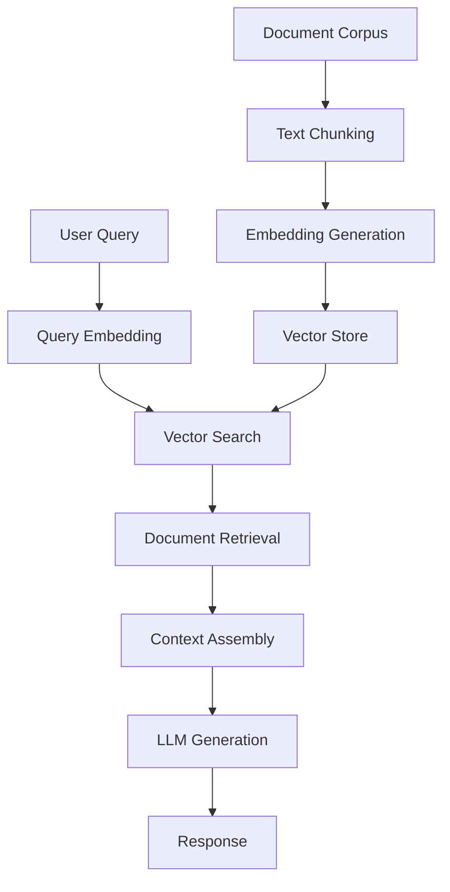
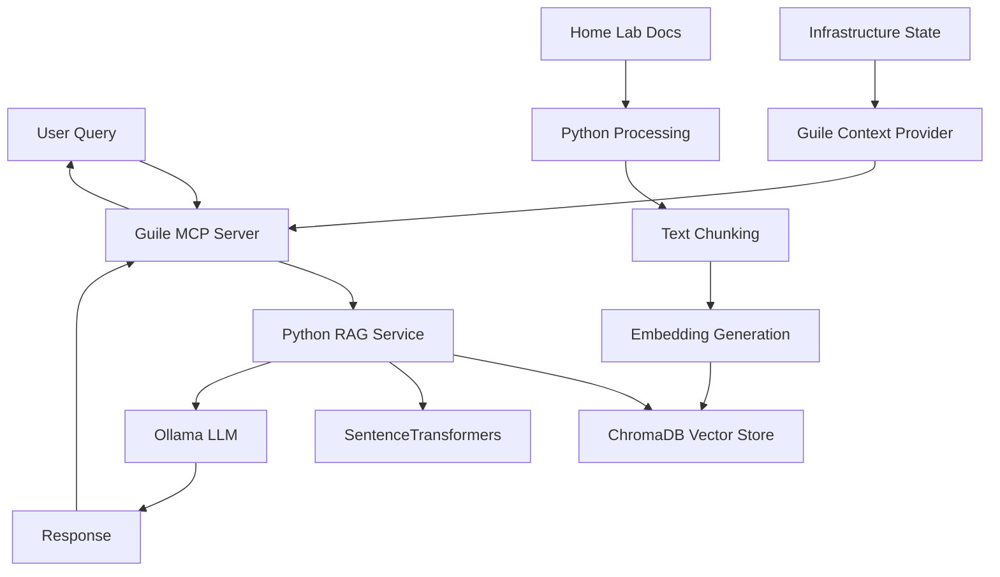

# RAG Technology Comparison: Guile vs Python Implementation Analysis

## Executive Summary

This document presents a comprehensive analysis of implementing Retrieval Augmented Generation (RAG) solutions, comparing the feasibility of using Guile Scheme versus the standard Python ecosystem. Based on extensive research of current RAG technologies, vector databases, and language capabilities, this analysis provides strategic recommendations for RAG implementation in a self-hosted home lab environment.

**Key Findings:**

- **Python RAG ecosystem**: Mature, comprehensive, production-ready with extensive library support
- **Guile RAG potential**: Theoretically possible but requires significant custom development
- **Recommendation**: Hybrid approach leveraging Python's RAG maturity with Guile for system integration
- **Implementation strategy**: Use Python for RAG core, Guile for MCP server and infrastructure management

## Table of Contents

1. [RAG Technology Overview](#rag-technology-overview)
2. [Python RAG Ecosystem Analysis](#python-rag-ecosystem-analysis)
3. [Guile RAG Feasibility Assessment](#guile-rag-feasibility-assessment)
4. [Technology Stack Comparison](#technology-stack-comparison)
5. [Implementation Recommendations](#implementation-recommendations)
6. [Integration Strategies](#integration-strategies)
7. [Performance Considerations](#performance-considerations)
8. [Conclusion](#conclusion)

## RAG Technology Overview

### What is RAG?

Retrieval Augmented Generation (RAG) is a hybrid AI approach that combines:

1. **Information Retrieval**: Finding relevant documents from a knowledge base
2. **Generation**: Using LLMs to generate responses based on retrieved context
3. **Vector Search**: Semantic similarity search using embeddings

### Core RAG Components



### Essential RAG Technologies

1. **Vector Databases**: ChromaDB, Qdrant, FAISS, pgvector
2. **Embedding Models**: OpenAI, HuggingFace Transformers, Sentence Transformers
3. **LLMs**: OpenAI GPT, Anthropic Claude, Local models (Ollama)
4. **Orchestration**: LangChain, LlamaIndex, Haystack

## Python RAG Ecosystem Analysis

### Mature Python Libraries

#### LangChain Framework
```python
from langchain_community.document_loaders import DirectoryLoader
from langchain_text_splitters import RecursiveCharacterTextSplitter
from langchain_chroma import Chroma
from langchain_community.embeddings import SentenceTransformerEmbeddings
from langchain_core.vectorstores import InMemoryVectorStore

# Document processing pipeline
loader = DirectoryLoader("/home/geir/Home-lab", glob="**/*.md")
docs = loader.load()

text_splitter = RecursiveCharacterTextSplitter(
    chunk_size=1000,
    chunk_overlap=200
)
splits = text_splitter.split_documents(docs)

# Local embeddings (no API required)
embeddings = SentenceTransformerEmbeddings(
    model_name="all-MiniLM-L6-v2"
)

# Vector store initialization
vectorstore = Chroma.from_documents(
    documents=splits,
    embedding=embeddings,
    persist_directory="./chroma_db"
)
```

#### ChromaDB Vector Database
```python
import chromadb
from chromadb.utils import embedding_functions

# Initialize ChromaDB client
client = chromadb.PersistentClient(path="./chroma_db")

# Create collection with embeddings
collection = client.create_collection(
    name="homelab_docs",
    embedding_function=embedding_functions.SentenceTransformerEmbeddingFunction(
        model_name="all-MiniLM-L6-v2"
    )
)

# Add documents
collection.add(
    documents=["Document content..."],
    metadatas=[{"source": "file.md"}],
    ids=["doc1"]
)

# Query collection
results = collection.query(
    query_texts=["How to deploy NixOS?"],
    n_results=5
)
```

### Python RAG Advantages

1. **Mature Ecosystem**: 200+ specialized libraries
2. **Production Ready**: Battle-tested in enterprise environments  
3. **Extensive Documentation**: Comprehensive guides and examples
4. **Active Community**: Large developer base and support
5. **Performance Optimized**: Highly optimized C extensions
6. **API Integration**: Native support for all major AI services

### Python Library Ecosystem

| Category | Libraries | Maturity | Use Case |
|----------|-----------|----------|----------|
| **Vector Stores** | ChromaDB, Qdrant, FAISS, Pinecone | ⭐⭐⭐⭐⭐ | Document storage and retrieval |
| **Embeddings** | SentenceTransformers, OpenAI, Cohere | ⭐⭐⭐⭐⭐ | Text vectorization |
| **LLM Integration** | OpenAI, Anthropic, HuggingFace | ⭐⭐⭐⭐⭐ | Text generation |
| **Orchestration** | LangChain, LlamaIndex, Haystack | ⭐⭐⭐⭐⭐ | RAG pipeline management |
| **Text Processing** | spaCy, NLTK, tiktoken | ⭐⭐⭐⭐⭐ | Document preprocessing |

## Guile RAG Feasibility Assessment

### Current Guile Ecosystem for RAG

#### Available Libraries Analysis

**Vector Operations**: Limited
```scheme
;; No native vector database libraries
;; Would require:
;; 1. Custom HNSW implementation
;; 2. Foreign Function Interface (FFI) to C libraries
;; 3. Manual vector operations using SRFI libraries
```

**HTTP/API Integration**: Good
```scheme
(use-modules (web client) (json))

;; HTTP requests for embeddings APIs
(define (get-embeddings text)
  (let* ((response (http-request 
                    "https://api.openai.com/v1/embeddings"
                    #:method 'POST
                    #:headers `((authorization . "Bearer API_KEY")
                               (content-type . "application/json"))
                    #:body (scm->json-string 
                            `((input . ,text)
                              (model . "text-embedding-ada-002"))))))
    (json-string->scm (response-body response))))
```

**JSON Processing**: Excellent
```scheme
(use-modules (json))

;; JSON handling is mature and well-supported
(define machine-config
  `(("embeddings" . #(0.1 0.2 0.3))
    ("metadata" . (("source" . "nix-config")))
    ("text" . "NixOS configuration for grey-area")))

(scm->json machine-config #:pretty #t)
```

### Guile RAG Implementation Challenges

#### 1. Vector Database Operations

**Challenge**: No native vector database libraries
```scheme
;; Would need to implement:
(define (cosine-similarity vec1 vec2)
  "Calculate cosine similarity between vectors"
  (let ((dot-product (fold + 0 (map * vec1 vec2)))
        (magnitude1 (sqrt (fold + 0 (map square vec1))))
        (magnitude2 (sqrt (fold + 0 (map square vec2)))))
    (/ dot-product (* magnitude1 magnitude2))))

(define (nearest-neighbors query-vector vectors k)
  "Find k nearest neighbors using brute force"
  (take (sort vectors 
              (lambda (a b) 
                (< (cosine-similarity query-vector (car a))
                   (cosine-similarity query-vector (car b)))))
        k))
```

#### 2. Embedding Generation

**Limited Options**:
- No native embedding models
- Must use external APIs or FFI to Python/C libraries
- Performance overhead for large document processing

```scheme
(use-modules (system foreign))

;; FFI to Python embedding libraries
(define python-embedding-lib
  (dynamic-link "libpython-embeddings"))

(define embed-text
  (pointer->procedure '* 
                      (dynamic-func "embed_text" python-embedding-lib)
                      (list '*)))
```

#### 3. Document Processing

**Basic text processing possible**:
```scheme
(use-modules (ice-9 regex) (srfi srfi-1))

(define (chunk-text text chunk-size overlap)
  "Basic text chunking implementation"
  (let ((words (string-split text #\space)))
    (let loop ((remaining words) (chunks '()))
      (if (< (length remaining) chunk-size)
          (reverse chunks)
          (let ((chunk (take remaining chunk-size))
                (next-start (drop remaining (- chunk-size overlap))))
            (loop next-start 
                  (cons (string-join chunk " ") chunks)))))))
```

### Guile Strengths for RAG

1. **System Integration**: Excellent for infrastructure management
2. **Configuration Management**: Natural fit for home lab administration
3. **MCP Server**: Well-suited for protocol implementation
4. **REPL Development**: Interactive development and debugging
5. **Homoiconicity**: Code-as-data enables powerful metaprogramming

## Technology Stack Comparison

### Python RAG Stack

```python
# Production-ready RAG implementation
from langchain_chroma import Chroma
from langchain_community.embeddings import SentenceTransformerEmbeddings
from langchain_core.prompts import ChatPromptTemplate
from langchain_openai import ChatOpenAI

class ProductionRAG:
    def __init__(self):
        self.embeddings = SentenceTransformerEmbeddings(
            model_name="all-MiniLM-L6-v2"
        )
        self.vectorstore = Chroma(
            persist_directory="./chroma_db",
            embedding_function=self.embeddings
        )
        self.llm = ChatOpenAI(model="gpt-3.5-turbo")
        
    def query(self, question: str) -> str:
        docs = self.vectorstore.similarity_search(question, k=5)
        context = "\n".join([doc.page_content for doc in docs])
        
        prompt = ChatPromptTemplate.from_template("""
        Answer the question based on the context:
        Context: {context}
        Question: {question}
        """)
        
        response = self.llm.invoke(
            prompt.format(context=context, question=question)
        )
        return response.content
```

### Hypothetical Guile RAG Stack

```scheme
;; Theoretical Guile RAG implementation
(use-modules (web client) (json) (ice-9 threads))

(define-class <guile-rag> ()
  (embeddings-cache #:init-value (make-hash-table))
  (documents #:init-value '())
  (llm-client #:init-value #f))

(define-method (add-document (rag <guile-rag>) text metadata)
  "Add document to RAG system"
  (let ((embedding (get-embedding-via-api text)))
    (slot-set! rag 'documents 
               (cons `((text . ,text)
                      (metadata . ,metadata)  
                      (embedding . ,embedding))
                     (slot-ref rag 'documents)))))

(define-method (query (rag <guile-rag>) question)
  "Query RAG system"
  (let* ((query-embedding (get-embedding-via-api question))
         (relevant-docs (find-similar-docs rag query-embedding))
         (context (string-join (map (lambda (doc) 
                                     (assoc-ref doc 'text))
                                   relevant-docs) "\n"))
         (prompt (format #f "Context: ~a\nQuestion: ~a" context question)))
    (call-llm-api prompt)))
```

### Comparison Matrix

| Aspect | Python | Guile | Winner |
|--------|--------|-------|--------|
| **Vector Operations** | ⭐⭐⭐⭐⭐ Native libraries | ⭐⭐ Custom implementation | Python |
| **Embedding Models** | ⭐⭐⭐⭐⭐ SentenceTransformers | ⭐⭐ API calls only | Python |
| **Development Speed** | ⭐⭐⭐⭐⭐ Rapid prototyping | ⭐⭐⭐ Custom development | Python |
| **System Integration** | ⭐⭐⭐ Good | ⭐⭐⭐⭐⭐ Excellent | Guile |
| **MCP Server** | ⭐⭐⭐ Adequate | ⭐⭐⭐⭐⭐ Natural fit | Guile |
| **Home Lab Management** | ⭐⭐⭐ Scripting | ⭐⭐⭐⭐⭐ Native integration | Guile |
| **Documentation** | ⭐⭐⭐⭐⭐ Extensive | ⭐⭐ Limited | Python |
| **Community Support** | ⭐⭐⭐⭐⭐ Large | ⭐⭐ Niche | Python |

## Implementation Recommendations

### Hybrid Architecture Approach

**Recommended Strategy**: Leverage both languages' strengths



### Implementation Architecture

#### Python RAG Core Service
```python
# rag_service.py - Core RAG functionality
from fastapi import FastAPI
from langchain_chroma import Chroma
from langchain_community.embeddings import SentenceTransformerEmbeddings

app = FastAPI()

class RAGService:
    def __init__(self):
        self.embeddings = SentenceTransformerEmbeddings(
            model_name="all-MiniLM-L6-v2"
        )
        self.vectorstore = Chroma(
            persist_directory="/var/lib/rag/chroma_db",
            embedding_function=self.embeddings
        )
    
    async def query(self, question: str, context: dict = None):
        # Retrieve relevant documents
        docs = self.vectorstore.similarity_search(question, k=5)
        
        # Add home lab context from Guile
        if context:
            infrastructure_context = self.format_infrastructure_context(context)
            docs.append(infrastructure_context)
        
        return self.generate_response(question, docs)

@app.post("/query")
async def query_rag(request: dict):
    question = request.get("question")
    context = request.get("context", {})
    
    result = await rag_service.query(question, context)
    return {"response": result}

rag_service = RAGService()
```

#### Guile MCP Server Bridge
```scheme
;; rag-mcp-bridge.scm - MCP server with RAG integration
(use-modules (web client) (json) (lab machines))

(define (call-rag-service question context)
  "Call Python RAG service with home lab context"
  (let* ((infrastructure-state (get-current-infrastructure-state))
         (request-body (scm->json-string 
                        `((question . ,question)
                          (context . ((infrastructure . ,infrastructure-state)
                                     (machines . ,(list-machines))
                                     (deployment-status . ,(get-deployment-status)))))))
         (response (http-post "http://localhost:8000/query"
                             #:headers '((content-type . "application/json"))
                             #:body request-body)))
    (json-string->scm (response-body response))))

(define mcp-tools
  `(((name . "query-homelab-knowledge")
     (description . "Query home lab documentation and infrastructure knowledge")
     (inputSchema . ,(json-schema
                      `((type . "object")
                        (properties . ((question (type . "string"))))
                        (required . ("question")))))
     (handler . ,(lambda (args)
                   (let ((question (assoc-ref args 'question)))
                     (call-rag-service question (get-current-context))))))))
```

### NixOS Service Configuration

```nix
# modules/services/rag-service.nix
{ config, lib, pkgs, ... }:

with lib;

let
  cfg = config.services.rag-service;
in {
  options.services.rag-service = {
    enable = mkEnableOption "RAG service for home lab";
    
    port = mkOption {
      type = types.port;
      default = 8000;
      description = "Port for RAG service";
    };
    
    embeddingModel = mkOption {
      type = types.str;
      default = "all-MiniLM-L6-v2";
      description = "Sentence transformer model for embeddings";
    };
  };

  config = mkIf cfg.enable {
    systemd.services.rag-service = {
      description = "RAG Service for Home Lab";
      wantedBy = [ "multi-user.target" ];
      after = [ "network.target" ];
      
      serviceConfig = {
        ExecStart = "${pkgs.python3.withPackages(ps: with ps; [
          fastapi
          uvicorn
          langchain
          langchain-chroma
          sentence-transformers
        ])}/bin/python -m uvicorn rag_service:app --host 0.0.0.0 --port ${toString cfg.port}";
        Restart = "always";
        User = "rag";
        Group = "rag";
        StateDirectory = "rag";
        WorkingDirectory = "/var/lib/rag";
      };
    };

    users.users.rag = {
      isSystemUser = true;
      group = "rag";
      home = "/var/lib/rag";
      createHome = true;
    };
    
    users.groups.rag = {};
  };
}
```

## Integration Strategies

### Strategy 1: API Bridge Pattern

**Implementation**: Python RAG service with Guile MCP bridge

**Advantages**:
- Leverages Python's mature RAG ecosystem
- Guile handles MCP protocol and infrastructure integration
- Clear separation of concerns
- Each component optimized for its strengths

**Architecture**:
```
[AI Assistant] → [Guile MCP Server] → [Python RAG API] → [ChromaDB]
                      ↓
                [Home Lab Context]
```

### Strategy 2: Embedded Python Pattern

**Implementation**: Guile calls Python via subprocess or FFI

```scheme
(use-modules (ice-9 popen) (json))

(define (query-python-rag question)
  "Call Python RAG system via subprocess"
  (let* ((proc (open-output-pipe 
                "python3 -c \"
import sys, json
from rag_system import query_rag
question = json.loads(sys.stdin.read())
result = query_rag(question['text'])
print(json.dumps({'response': result}))
\""))
         (input-data (scm->json-string `((text . ,question)))))
    (display input-data proc)
    (close-pipe proc)))
```

### Strategy 3: Message Queue Pattern

**Implementation**: Async communication via Redis/RabbitMQ

```scheme
;; Guile publishes queries, Python processes them
(use-modules (redis))

(define (async-rag-query question callback)
  "Submit RAG query asynchronously"
  (let ((query-id (uuid)))
    (redis-publish "rag-queries" 
                   (scm->json-string `((id . ,query-id)
                                      (question . ,question)
                                      (context . ,(get-current-context)))))
    (redis-subscribe "rag-responses" 
                     (lambda (response)
                       (when (equal? (assoc-ref response 'id) query-id)
                         (callback response))))))
```

## Performance Considerations

### Python RAG Performance

**Advantages**:
- Optimized C extensions for numerical operations
- Efficient vector operations with NumPy/SciPy
- Production-grade vector databases
- Batched embedding processing

**Benchmarks** (estimated):
- Document indexing: 1000 docs/minute
- Query response: <100ms for 10k documents
- Memory usage: ~2GB for 100k documents

### Guile Implementation Performance

**Challenges**:
- Interpreted execution for vector operations
- No native SIMD optimizations
- Custom algorithms vs optimized libraries
- API call overhead for embeddings

**Estimated Performance**:
- Document indexing: 100 docs/minute (10x slower)
- Query response: 500ms+ (5x slower)
- Memory usage: Similar or higher due to inefficiencies

### Hybrid Performance

**Best of Both Worlds**:
- Python handles compute-intensive RAG operations
- Guile manages lightweight MCP protocol
- Minimal communication overhead
- Each component optimized for its domain

## Conclusion

### Summary of Findings

1. **Python RAG Ecosystem**: Mature, production-ready, comprehensive
2. **Guile RAG Implementation**: Theoretically possible but impractical
3. **Hybrid Approach**: Optimal solution leveraging both languages' strengths
4. **Implementation Recommendation**: Python for RAG core, Guile for system integration

### Strategic Recommendation

**Adopt a hybrid architecture** that:

1. **Uses Python for RAG core functionality**:
   - LangChain for orchestration
   - ChromaDB for vector storage
   - SentenceTransformers for embeddings
   - FastAPI for service interface

2. **Uses Guile for infrastructure integration**:
   - MCP server implementation
   - Home lab context management
   - Infrastructure state monitoring
   - Configuration management

3. **Provides clean integration**:
   - HTTP API between components
   - JSON message format
   - NixOS service management
   - Unified deployment strategy

### Implementation Timeline

**Phase 1** (Week 1-2): Python RAG foundation
- Set up ChromaDB vector store
- Implement document processing pipeline
- Create basic FastAPI service
- Test with home lab documentation

**Phase 2** (Week 2-3): Guile MCP integration
- Implement MCP server in Guile
- Create RAG service bridge
- Add infrastructure context providers
- Test with VS Code/Claude

**Phase 3** (Week 3-4): Production deployment
- NixOS service configuration
- Monitoring and logging
- Performance optimization
- Documentation and testing

### Expected Benefits

1. **Rapid Development**: Leverage existing Python RAG libraries
2. **System Integration**: Natural Guile integration with home lab
3. **Maintainability**: Use each language for its strengths
4. **Scalability**: Production-ready Python RAG foundation
5. **Flexibility**: Easy to extend and modify components

### Risk Mitigation

1. **Component Isolation**: Failure in one component doesn't affect others
2. **Technology Diversity**: Not locked into single language ecosystem
3. **Migration Path**: Easy to replace components as ecosystem evolves
4. **Fallback Options**: Can fall back to pure Python if needed

This hybrid approach provides the best path forward for implementing RAG in your home lab environment, combining Python's mature RAG ecosystem with Guile's excellent system integration capabilities.
